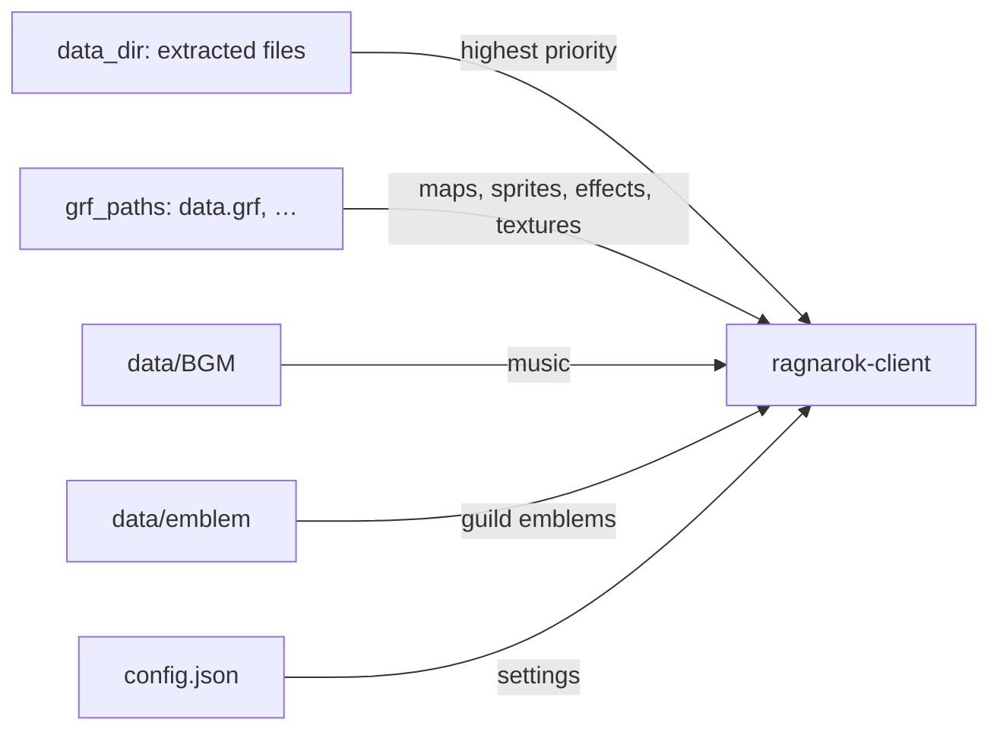
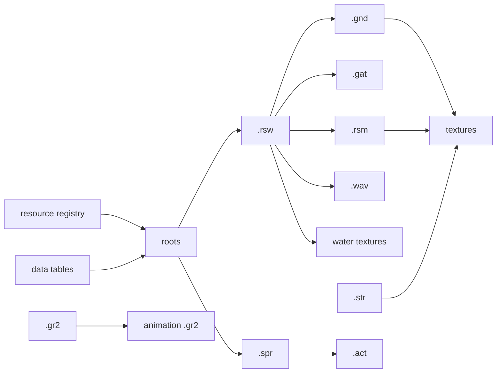

The goal is to have a playable client to retrieve the classic RO experience (2004-2008) for nostalgic players.

It reuses many parts of [rust-ro](https://github.com/nmeylan/rust-ro): packets, data structures, proc-macros.

**This repository does not and will not provide any game assets**.

# Progress
- Global: https://www.youtube.com/playlist?list=PLItjqXXRF2YA
- Per class: https://www.youtube.com/playlist?list=PLItlNRkjsngk

See [TODO](docs/TODO.md) 100% completed and [Features.md](Features.md). 

Architecture is documented in [docs/internal/architecture.md](docs/internal/architecture.md) and [docs/internal/rendering.md](docs/internal/rendering.md).

Profiling and stress testing are documented in [docs/profiling.md](docs/profiling.md).

# Why yet another client?
I wanted to run the game as it was in 2005~2008, but the original client from that period does not handle high dpi screens well. It is also painful to find the right game resources and the right exe diff to make it work with a server.

Other implementations either do not focus on this version of the client, or do not aim for an exact match.

I also wanted a clear view on what is implemented and what is not.

# Principles
- Support any game resources up to EP 12 (included)
- Support all packet versions up to 20120307 without recompiling
- Support **ALL** visual effects accurately
- Do not alter original game resources: render actual resources with high dpi support
- Runnable on Windows and Linux
- Use a "mini framework" for the UI, in immediate mode, inspired by `egui`

# Prerequisites

- **Rust toolchain.** The workspace pins Rust `1.97.0` through a `rust-toolchain.toml` file. Install [rustup](https://rustup.rs) and the correct toolchain is selected automatically when we build from the repository root.
- **`cargo-watch`** (only for the hot-reload development tools). Install it with `cargo install cargo-watch`. The game client and the standalone viewers do not need it.
- **A running server.** The client is a network client: it connects to a login server.
- **Game resources.** this repository provides none. See the next section.

# Game resources you need to supply

None of the resource files are committed (they are git-ignored). Place them under `data/` at the repository root before building or running.

```
classic-client/
  data/
    data.grf        # required: GRF archive with maps, sprites, effects, textureswe
    BGM/            # optional: background music files (.mp3 / .wav)
    emblem/         # optional: guild emblem .bmp files (24-bit, 24x24)
    extracted/      # optional: loose files that override the archive (see data_dir)
      sprite/
      texture/
```

The GRF archive holds everything the renderer reads: maps (GAT/RSW/GND), sprites (SPR/ACT), effects (STR), 3D models (RSM/GR2), and textures. The client and every tool read resources by their Korean names, exactly as they are stored in the archive; we do not rename or repack them.

Resources are resolved by priority. `data_dir` (loose extracted files) is checked first, then each archive in `grf_paths` in order, so the first archive wins over the later ones. This lets a second GRF, or a folder of extracted files, override individual resources without touching the base archive. The layout inside `data_dir` mirrors the archive's `data/` folder: to override `data/sprite/foo.spr`, place the file at `<data_dir>/sprite/foo.spr`.

The runtime picture looks like this.



# Build

Build every crate from the repository root.

```bash
cargo build --release 
cargo test           
```

# Configure

Settings live in `config.json` at the repository root. The client reads it on start and writes it back on quit (and when settings change in game), so most fields are managed at runtime. The file is parsed with serde; any missing field falls back to its default, so a partial file is valid.

`config.json` is per-developer and not versioned. Copy the sample to create it:

```bash
cp config.sample.json config.json
```

Starting the client without the file is also fine: it writes one with the defaults. Changes that should reach everyone go in `config.sample.json`.

The fields a newcomer sets by hand:

| Field | Type | Default | Meaning |
| --- | --- | --- | --- |
| `packetver` | number | `20120307` | Default packet protocol version to speak. Any value up to 20120307 works without recompiling. Must match the server. Overridden per server by `login_servers[].packetver`. |
| `login_servers` | object[] | `[{ "name": "Local", "host": "127.0.0.1", "port": 6900 }]` | Connection (login) servers to choose from. Each has a `name`, `host`, `port`, and an optional `packetver` overriding the top-level one while selected. When more than one is listed the client shows a selection screen before login; a single server is used directly. |
| `grf_paths` | string[] | `["data/data.grf"]` | GRF archives to load, in priority order. The first archive wins on conflict; each later archive only supplies files the earlier ones lack. |
| `data_dir` | string | *(unset)* | Optional directory of files extracted from a GRF. Its files override every archive in `grf_paths`, so it is the way to swap individual resources without repacking. Contents mirror the inside of the archive's `data/` folder (e.g. `sprite/…`, `texture/…`); matching is case-insensitive. |
| `bgm_path` | string | `BGM` | Folder holding background music. `config.json` ships with `data/BGM`. |
| `emblem_path` | string | `emblem` | Folder holding guild emblem `.bmp` files. `config.json` ships with `data/emblem`. |
| `screen_width` / `screen_height` | number | `1024` / `768` | Initial window size. |
| `fullscreen` | bool | `false` | Start in fullscreen. |
| `dpi_scale` | number | `125.0` | UI scale in percent. This is the high dpi support: raise it on high resolution screens. |
| `bgm_volume` / `sfx_volume` | number | `0.8` | Volume, `0.0` to `1.0`. |
| `bgm_enabled` / `sfx_enabled` | bool | `true` | Sound toggles. |
| `map_recovery_command` | string | `@go prontera` | Chat command sent by the recovery window when a map cannot load because its data is missing from the GRF. |
| `trace_packets_send` / `trace_packets_recv` | bool | `false` | Log sent / received packets. Useful when investigating network issues. |

The remaining fields (`window_state`, `keybindings`, `shortcut_commands`, `emotion_keys`, `display`, `last_char_slot`, and other in-game toggles) are written by the client as we play and rebind keys.

# Texture filtering

The original game filters every texture bilinearly and never changes that state
while it runs. We do the same by default, and ground and model textures get a mip
chain on top, which is what the original enables for the pass that draws them.
Three checkboxes on the `Texture Filtering:` row of the graphic options window
(Esc, then Graphics) turn filtering off per family, and each one is stored in
`config.json`:

| Checkbox | Config key | Covers |
| --- | --- | --- |
| Map | `custom.filtering.world` | Ground, models, water |
| Effects | `custom.filtering.effects` | STR and primitive effect textures |
| Sprites | `custom.filtering.sprites` | Players, monsters, NPCs, items |

I recommend (it looks better) to also set `custom.filtering.sprite_upscale` to `true` when `custom.filtering.sprites` is true, but as it consume more vram the default is `false`.

It has its own checkbox on the row below, `Sprite upscale`. Ticking it reloads
the sprites at once and reports the factor it derived in the chat window, so no
restart is needed.

See [Texture filtering](docs/configuration.md#texture-filtering) and
[Sprite upscale](docs/configuration.md#sprite-upscale) for what each value does
and what it costs.

Notes: For sprites and world I personally prefer nearest sampling, with no sprite upscale, even though it is
a divergence from the original game. Nearest takes the colour of the single texel
closest to the sample point, where bilinear blends the four texels around it. 
The pixels of a sprite stay hard and its silhouette carries no dark rim, at the cost
of aliasing once a sprite is drawn smaller than its source. 


# Run

With `data/data.grf` in place and a server running:

```bash
cargo run --bin ragnarok-client --release
```

The client reads `config.json` from the current directory, so run it from the repository root.

# Set up a server

If you want to test quickly setup your own server use a fork of [rathena](https://github.com/nmeylan/rathena), preconfigured with packetvver `20111102`, with remapped port (prefixed default port with `2`:  `3306` -> `23306`) allowing testing without conflicting with existing server. 

```sh
git clone --single-branch --branch nostalro https://github.com/nmeylan/rathena
```

## Build and start

```bash
cd tools/docker

# Build the servers once. Runs ./configure (packetver 20111102, prere)
# and `make clean server` inside the container.
docker compose run --rm builder

# Start the database and the login, char, and map servers.
docker compose up -d
```

The database comes up on `localhost:23306` with database, user, and password all set to `ragnarok`. The login server listens on `26900`, which matches the default `login_servers` entry in `config.json`.

## Base characters

`create_chars.sql` at the root of the server repository creates three GM accounts (`test1`, `test2`, `test3`, each with its password equal to the account name) and one fully leveled character per class. Load it once the database container is running:


```bash
# from tools/docker
docker compose exec -T db mariadb -uragnarok -pragnarok ragnarok < ../../create_chars.sql
```

Log in from the client with `test1` / `test1`.

Each account holds a different set of classes, starting with 1M zeny and all skills learn:

- **`test1`** (female): Lord Knight, High Priest, High Wizard, Sniper, Assassin Cross, Paladin, Champion, Professor, Gypsy.
- **`test2`** (male): Whitesmith, Stalker, Creator, Clown, Super Novice, Gunslinger, Ninja, Taekwon.
- **`test3`** (male): no characters, an empty account for creating your own char, to test adoption.

## Match the packet version

This server is built for packet version `20111102`. Set `packetver` to `20111102` in `config.json` (or on the matching `login_servers` entry) so the client and server speak the same protocol.
```config.json
"login_servers": [
    {
      "name": "Nostalro local",
      "host": "127.0.0.1",
      "port": 26900,
      "packetver": 20111102
    }
}
```

# Development tools

Every tool reads the same code paths as the game, so what a tool shows is what the game renders. The viewers take a `--grf` argument that defaults to `data/data.grf`; the two GRF audit tools take the archive as their first positional argument instead, since they have no sensible default. The hot-reload tools (the `tools/*-dev.sh` scripts) rebuild and reload on source change and need `cargo-watch`; the plain `cargo run` tools do not.

## Sprite viewer

Browse and preview SPR/ACT sprites from a GRF. Needs a GRF only.

```bash
# Open with a GRF file picker (scans the current directory for .grf files)
cargo run --bin sprite-viewer --release

# Open a specific GRF
cargo run --bin sprite-viewer --release -- --grf data/data.grf
```

## GRF editor

Inspect and edit GRF archives. Needs a GRF only.

Features:
- Render bmp, tga, spr (act), str, rsw
- Grid mode: view all elements in a grid to ease finding resources
- Export an element
- Add an element
- Play a sound

```bash
cargo run --bin ragnarok-grf-editor --release
```

## Effect viewer (hot reload)

Effects need a large number of iterations to get right. This viewer reloads on change so feedback is almost immediate. Needs a GRF and `cargo-watch`. Edit anything under `lib/effects/src`, `lib/renderer/src/effect/`, or `tools/effect-viewer-hot/src`.

```bash
tools/effect-viewer-dev.sh                 # uses data/data.grf
tools/effect-viewer-dev.sh path/to/data.grf
```

Without hot reload (no `cargo-watch`), run the viewer directly:

```bash
cargo run --bin effect-viewer --release -- --grf data/data.grf
```

## Unified viewer (hot reload)

Renders a scene plus a sprite plus an effect in the same tool. This validates effect rendering against actual entity rendering: effect size (beginspell), entity alteration (body tint, body size change), and effect alpha / additive behavior. Needs a GRF and `cargo-watch`.

```bash
tools/viewer-dev.sh                             # prontera, default GRF
tools/viewer-dev.sh --map geffen                # different map
tools/viewer-dev.sh --grf path/to/data.grf      # explicit GRF
tools/viewer-dev.sh --map prontera --effect 42  # spawn an effect at startup
```

Without hot reload (no `cargo-watch`), run the viewer directly with the same arguments:

```bash
cargo run --bin viewer --release                                 # prontera, default GRF
cargo run --bin viewer --release -- --map prontera --effect 42   # explicit map and effect
```

Controls: `B` cycles the background, right-drag orbits, scroll (or `+`/`-`) zooms, `C` resets the camera, `Space` pauses, arrow keys change action/direction, `N`/`P` cycle the effect preset and `F` replays it.

## Map (RSW) viewer (hot reload)

Preview a map with camera, overlays, and an info panel. Needs a GRF and `cargo-watch`. Edit `tools/rsw-viewer-hot/src/lib.rs`.

```bash
tools/rsw-viewer-dev.sh                          # default GRF
tools/rsw-viewer-dev.sh path/to/data.grf geffen  # explicit GRF and map
```

Without hot reload (no `cargo-watch`), run the viewer directly:

```bash
cargo run --bin rsw-viewer -- --grf data/data.grf
cargo run --bin rsw-viewer -- --grf data/data.grf --map geffen  # explicit map
```

## Rendering viewer (hot reload)

Iterate on isolated rendering pieces such as damage numbers. Needs a GRF and `cargo-watch`. Edit `lib/game/src/damage_number.rs` or `tools/rendering-viewer-hot/src`.

```bash
tools/rendering-viewer-dev.sh
tools/rendering-viewer-dev.sh path/to/data.grf
```

Without hot reload (no `cargo-watch`), run the viewer directly:

```bash
cargo run --bin rendering-viewer -- --grf data/data.grf
```

## UI component viewer (hot reload)

Building UI takes many iterations, so the UI was designed from scratch to be hot reloadable. This runs a single window example or a category of windows and reloads on change. Needs `cargo-watch` (and a GRF for windows that show sprites).

```bash
# A single window example
tools/ui-component-dev.sh inventory
tools/ui-component-dev.sh npc_shop --grf data/data.grf

# A category (several windows at once)
tools/ui-component-dev.sh game       # inventory, npc_shop, npc_dialog, equipment, system_menu, confirm_dialog, chat
tools/ui-component-dev.sh account    # login, server_list, char_select
tools/ui-component-dev.sh companion  # homunculus, mercenary, pet
tools/ui-component-dev.sh guild      # guild
tools/ui-component-dev.sh social     # guild, party, vending board, emotion, mailbox, trade
tools/ui-component-dev.sh chat       # chat, chat room create/member/board
tools/ui-component-dev.sh shop       # cart, vending_setup, my_shop, vending_buy
tools/ui-component-dev.sh map        # world_map, minimap
```

Without hot reload (no `cargo-watch`), build the dylib once and run the host directly. It still loads the windows, it just does not reload on source change:

```bash
cargo build -p ragnarok-ui-component-hot
cargo run --example hot_reload -p ragnarok-ui-component -- --example inventory
cargo run --example hot_reload -p ragnarok-ui-component -- --example npc_shop --grf data/data.grf
```

## GR2 viewer

Render Granny (GR2) 3D models: guild flags, guardians, the Emperium. Needs a GRF, and an emblem `.bmp` when rendering a guild flag.

```bash
# guild flag with emblem
cargo run -p ragnarok-tools --bin gr2-viewer -- --grf data/data.grf guildflag90_1.gr2 --emblem data/emblem/emblem_0013.bmp

# archer guardian
cargo run -p ragnarok-tools --bin gr2-viewer -- --grf data/data.grf aguardian90_8.gr2

# knight guardian
cargo run -p ragnarok-tools --bin gr2-viewer -- --grf data/data.grf data/model/3dmob/kguardian90_7.gr2

# Emperium
cargo run -p ragnarok-tools --bin gr2-viewer -- --grf data/data.grf data/model/3dmob/empelium90_0.gr2
```

## GRF audit: verify, prune and merge

Three command line tools answer the same question from different sides: which entries of an archive can the client actually reach? `grf-verify` lists what the client asks for and the archive does not hold. `grf-prune` lists what the archive holds and nothing asks for, and can write a smaller archive without it. `grf-merge` flattens a stack of archives into one, with the same precedence the client applies at runtime.

They share one engine, `tools/src/grf_audit`. It starts from the roots, every path the client names on its own, then follows references from file to file until nothing new appears. The roots are the [`ragnarok-resources`](lib/resources/src/lib.rs) registry (every path the code states outright) plus one path per row of every data table the client reads: item resources, job and NPC identity, accessory, skill sounds, effect tables, quest artwork, status icons, skill icons, `.gr2` actors, and the map list.



Walking the whole graph of a 43895 entry, 1321.3MB archive takes under 3.5 seconds, so both tools are cheap enough to run on every build.

### grf-verify

```bash
cargo run --release --bin grf-verify -- data/data.grf
cargo run --release --bin grf-verify -- data/data.grf --limit 5   # paths shown per group, 0 for all
cargo run --release --bin grf-verify -- data/data.grf --quiet     # counts only
```

Findings are grouped by who asked for the file, so a table that names files the archive lacks reads as one line rather than thousands:

```
data/data.grf — 43895 entries, 33049 roots, 30733 reached
21331 probed paths absent (job/palette/headgear combinations the client tries and does without) — not reported

4093 missing:

  built from effect str alias table — 70
  built from item resource table — 2767
  built from job/npc identity table — 1250
  declared in the resource registry — 2
  referenced by a map (.rsw) — 2
```

The tool exits 1 when anything is missing, so it can gate a build.

Most roots are combinations rather than requirements: every job crossed with every palette id, every headgear crossed with both sexes, every item crossed with a drop sprite. The client asks for those and draws fine without them, so their absence is not a defect. Only paths the client genuinely requires are listed; the rest are counted on the second line. A `.spr` requires its `.act`, but an `.act` does not require a `.spr` of the same name, because pet headgear animations ride on the pet's own sprite.

### grf-prune

Report only by default. The input archive is never modified, and `--write` produces a new file.

```bash
cargo run --release --bin grf-prune -- data/data.grf
cargo run --release --bin grf-prune -- data/data.grf --write data/light.grf
cargo run --release --bin grf-prune -- data/data.grf --list texture   # print what would be dropped
cargo run --release --bin grf-prune -- data/data.grf --keep data/texture/effect/
```

```
data/data.grf — 43895 entries, 1321.3MB
33049 roots, 30733 entries reached

                  keep               drop
map               1710    506.7MB       0      0.0MB  (every map is a root without --server; pass one to narrow them)
texture           8132    361.2MB     875     45.9MB
ui                9287    168.4MB       0      0.0MB  (interface artwork is named by client code and by server-sent strings, so no table walk can enumerate it)
model             3401     12.1MB     136      0.4MB
sprite           16683     84.0MB       0      0.0MB  (not selected)
palette            994      0.6MB       0      0.0MB  (not selected)
sound             2040    133.1MB       0      0.0MB  (monster and NPC sounds are chosen by the server, not by any client table we can enumerate)
imf                 78      0.0MB       0      0.0MB  (not selected)
unclassified       559      8.9MB       0      0.0MB  (not understood)

total: keep 1275.0MB / drop 46.3MB (3.5% smaller)
```

The tool declines to judge whatever it cannot enumerate. Each category carries a verdict on whether we trust our root set for it:

| Category | Prunable |
| --- | --- |
| `texture`, `model` | Always. Dropped by default. |
| `imf` | Always, but not selected by default: the whole tree is a rounding error in bytes, and a missing `.imf` silently reorders an actor's head over its body. |
| `sprite`, `palette` | Only when the identity lua is in the archive. With the builtin job table as fallback we cannot promise the list is complete. |
| `ui` | Never. Interface artwork is named by client code and by strings the server sends, such as the wedding illustration, so no walk of the data tables can enumerate it. |
| `sound` | Never. Monster and NPC sounds are chosen by the server and no client table lists them. |
| `map` | Only with `--server`. Without it every map is a root. |
| `unclassified` | Never. |

Anything whose extension we do not model lands in `unclassified` and survives, which is why the `.fna` files sitting beside the `.imf` files are kept. Selecting a category with `--prune` does not override its verdict; a category we do not trust stays untouched and prints its reason.

```bash
# default selection
cargo run --release --bin grf-prune -- data/data.grf --prune texture,model

# add sprites and palettes, which needs the identity lua in the archive
cargo run --release --bin grf-prune -- data/data.grf --prune texture,model,sprite,palette
```

### Narrowing the map list

Maps are 506.7MB of the 1321.3MB archive, and their textures and models are most of the rest, so the map list is the one lever that changes the result by a large amount. `--server` takes either a rathena checkout or a text file with one map name per line:

```bash
# read db/map_index.txt from a rathena checkout
cargo run --release --bin grf-prune -- data/data.grf --server ../rathena-nmey --prune map,texture,model,imf

# or list the maps we actually serve
printf 'prontera\ngeffen\npayon\n' > maps.txt
cargo run --release --bin grf-prune -- data/data.grf --server maps.txt --prune map,texture,model,imf
```

rathena ships the full official index, which lists more maps than the archive holds, so it narrows almost nothing: on `data.grf` it frees 3 files. A hand written list is what shrinks an archive. With ten maps listed the same archive goes from 1321.3MB to 325.6MB, because the textures and models only the other maps used stop being reachable too.

To check that a prune removed nothing the client needs, audit the result with the same options. The reached count must not change:

```bash
cargo run --release --bin grf-prune  -- data/data.grf --server maps.txt --prune map,texture,model --write data/light.grf
cargo run --release --bin grf-verify -- data/light.grf --server maps.txt --quiet
```

### grf-merge

The client runs off a priority ordered stack of archives: `grf_paths[0]` wins and later archives only supply what the earlier ones lack. `grf-merge` flattens that stack into one archive with the same precedence, and prunes it on the way out. Report only by default; the input archives are opened read only and are never modified.

```bash
cargo run --release --bin grf-merge -- data/data.grf data/data-2.grf
cargo run --release --bin grf-merge -- data/data.grf data/data-2.grf --write data/merged.grf
```

It takes the same `--server`, `--prune`, `--keep` and `--list` flags as `grf-prune`, with the same category verdicts, so the two tools cannot drift on what counts as unused.

```
1. data/data.grf — 43895 entries
2. data/data-2.grf — 35335 entries

merged — 44765 entries, 1335.7MB
34022 roots, 31544 entries reached
15 table(s) folded across archives:
  data/resnametable.txt (0.1MB)
  data/idnum2itemdisplaynametable.txt (0.4MB)
  data/questid2display.txt (1.2MB)
  ...
```

# Divergence from original client

## AI
Instead of using Lua files from the player directory to implement AI, we implement a highly configurable AI in the client directly, inspired by [AzzyAI](https://github.com/SpenceKonde/AzzyAI).

Reasons:
- We do not want to add Lua support. As the sources are available, there is no need for an external system to customize the client: changes happen directly in the Rust code, and a plugin system will be added later.
- In our experience many Lua scripts for homunculus were buggy and suboptimal. Newbie players had to use the default AI scripts, which were bad, while experienced players had advanced scripts for their homunculus.

# AI usage
This project leverages AI to allow faster development, as our time is limited. AI is used for:
- Fixing network packet handling: investigating raw packet traces
- Helping to implement rendering (wgpu and wgsl API): our knowledge of wgpu and wgsl was almost zero when we started
- Game resource format handling
- Refactoring tasks
- Writing tools
- Effect analysis (from gif) and implementation

# Resources
Without the resources below, our memories alone were not enough to reach visual parity with the original game.

ALL effects have been implemented; this would not have been possible without:
- **Waken** youtube channel https://www.youtube.com/@wakenragnadev6265
- https://casual-ragnarok.github.io/ro-effects/

Various gameplay / effect / UI rendering references:
- https://www.youtube.com/@lordknightnecri1603 (effects)
- https://www.youtube.com/watch?v=-XCxB3hem-A&list=PLbEyWK1BqG7oYWWnTg9ENpIB_XESvml8P&index=28 (effects)
- https://www.youtube.com/watch?v=P__GwtWu6pQ (marionette dolls)
- http://guidesragnarok.free.fr/guides/guildes.php (guild)
- https://www.youtube.com/watch?v=BuEU4GeoUPQ (chat room)

# Special thanks
- [@eleriaqueen](https://github.com/eleriaqueen): detailed, accurate bug reports that improved nearly every part of this client.