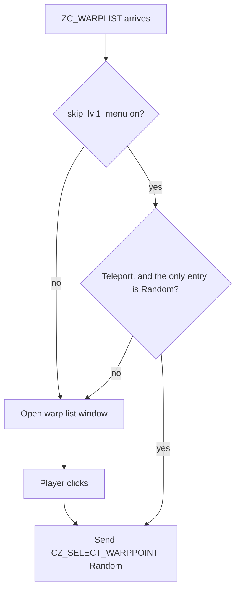

# Configuration

The client reads `config.json` from the working directory at startup
(`Config::load_or_default` in [`client/src/config.rs`](../client/src/config.rs)). When
the file is absent we write a fresh one filled with the defaults listed below.
When it is present but fails to parse we log a warning and fall back to the full
default set, leaving the file untouched.

Every key is optional: the struct carries `#[serde(default)]`, so a missing key
takes its default and an unknown key is ignored. The Mandatory column therefore
marks the keys we must set to a real value for the client to connect and load
resources, not keys the parser requires.

We rewrite `config.json` at runtime whenever a persisted setting changes (sound
options, graphic options, keybindings, window layout, character slot, and the
`/effect`-family slash commands). Hand edits made while the client is running
are lost on the next save.

## Top level

| Config key | Description | Default value | Mandatory |
| --- | --- | --- | --- |
| `login_servers` | Selectable connection servers. The first is used by default; with more than one entry the client shows a server selection screen after login. See [Login server](#login-server). | `[{"name": "Local", "host": "127.0.0.1", "port": 6900, "packetver": 20111102}]` | Yes |
| `keep_login_id` | Store the last login ID in `saved_username` and pre-fill it on the login screen. The password is never stored. | `false` | No |
| `saved_username` | Login ID written back by the login screen when `keep_login_id` is on. | `""` | No |
| `screen_width` | Requested initial window width, in logical pixels. Multiplied by the OS scale factor, not by `dpi_scale`. Only a request, and rewritten on exit: see [Window size](#window-size). | `1024` | No |
| `screen_height` | Requested initial window height, in logical pixels. Same handling as `screen_width`. | `768` | No |
| `fullscreen` | Start borderless fullscreen. Also toggled from the graphic options window. | `false` | No |
| `dpi_scale` | UI scale in percent. `125.0` means 1.25x. Values at or below `0` fall back to 1.0x. | `125.0` | No |
| `grf_paths` | GRF archives to mount, in priority order. | `["data/data.grf"]` | Yes |
| `data_dir` | Directory of files extracted from a GRF. Its contents mirror the inside of the archive's `data/` folder (`sprite/…`, `texture/…`) and take priority over every entry in `grf_paths`. | `null` | No |
| `bgm_path` | Directory on disk holding the BGM tracks. Read from the filesystem, not from the GRF. | `"BGM"` | No |
| `emblem_path` | Directory where downloaded guild emblems are cached. | `"emblem"` | No |
| `bgm_volume` | Background music volume, `0.0` to `1.0`. | `0.8` | No |
| `sfx_volume` | Sound effect volume, `0.0` to `1.0`. | `0.8` | No |
| `bgm_enabled` | Play background music. When off the effective BGM volume is `0.0`. | `true` | No |
| `sfx_enabled` | Play sound effects. When off the effective SFX volume is `0.0`. | `true` | No |
| `free_camera` | Screenshot escape hatch: drops the pitch band, the indoor rotation clamp and the zoom clamp. Off keeps the original game's bands. | `false` | No |
| `fog` | Apply the map's RSW fog settings. | `false` | No |
| `show_skill_effects` | The `/effect` flag. When false, one-shot skill, attack and item effects are dropped; keyed persistent visuals such as auras stay. | `true` | No |
| `battle_mode` | Hotkey bar battle mode: number keys trigger hotkeys instead of typing into chat. | `false` | No |
| `hotkey_visible_rows` | Number of hotkey bar rows shown. | `1` | No |
| `refuse_trade` | Auto-decline incoming trade requests. | `false` | No |
| `refuse_party_invite` | Auto-decline incoming party invitations. | `false` | No |
| `map_recovery_command` | Chat command sent by the map-recovery window's warp button when a map cannot be loaded because its data is missing from the GRF. | `"@go prontera"` | No |
| `last_char_slot` | Slot of the character selected last, restored to preselect it and its page on the next character-select screen. Client-side only; the server sends no last-used marker. | `null` | No |
| `account_backgrounds` | GRF texture paths for the account-screen background. One is picked at random per session and stretched behind the login, server and character screens. Empty or all-missing falls back to the solid clear color. | `["data/texture/유저인터페이스/rag_title.bmp", "data/texture/유저인터페이스/rag_title2.bmp", "data/texture/유저인터페이스/rag_title3.bmp"]` | No |
| `admin_account_ids` | Account ids treated as GM. Their characters use the Operator body sprite and render their name, guild name and chat in yellow. | `[]` | No |
| `see_self_as_gm_when_gm` | When the local player's account id is in `admin_account_ids`, also render it as a GM to itself. No effect for non-GM accounts. | `false` | No |
>>>

| `debug_network_delay_ms` | Artificial delay applied to outgoing packets, in milliseconds. Testing aid. | `0` | No |
| `shortcut_commands` | Chat commands bound to Alt+1 through Alt+0 by the Shortcut List window. Ten slots. | `["/!", "/?", "/ho", "/lv", "/swt", "/ic", "/an", "/ag", "/$", "/..."]` | No |
| `keybindings` | Key chord per hotkey action. Missing actions are filled from the defaults at load time. See [Keybindings](#keybindings). | all 22 actions bound, listed in [Keybindings](#keybindings) | No |
| `emotion_keys` | Trigger key per emote, keyed by emote type. See [Emotion keys](#emotion-keys). | `{}` | No |
| `window_state` | Saved position, open and collapsed state per UI window. See [Window state](#window-state). | `{}` | No |
| `display` | Name plate, damage and cast bar visibility. See [display](#display). | `{"show_other_damage": true, "show_other_cast_bars": true, "hide_name_player": false, "hide_name_monster": false, "hide_name_npc": false, "show_level_aura": true}` | No |
| `snap` | Mouse snapping targets. See [snap](#snap). | `{"monster_no_skill": false, "monster_skill": true, "item": false}` | No |
| `debug` | Trace toggles. See [debug](#debug). | `{"trace_packet": "none", "trace_effects": false, "trace_input": false, "trace_texture_load": false, "trace_sprite_scale": false}` | No |
| `accessibility` | Name plate weight, and the geometry and colours of the overhead HP, monster HP, SP and cast bars. See [accessibility](#accessibility). | `{"bold_name_plates": false, "hp_bar": {"width": 60.0, "height": 5.0, "background_color": "#424242", "border_color": "#10189C", "fill_color": "#10EF21", "fill_color_low": "#FF0000"}, "monster_hp_bar": {…, "fill_color": "#FF00E7", "fill_color_low": "#FFFF00"}, "sp_bar": {…, "fill_color": "#1863DE"}, "cast_bar": {…, "height": 7.0, "fill_color": "#00CC00"}}` | No |
| `custom` | Behaviour the original game has no counterpart for. See [custom](#custom). | `{"boss_aura": false, "fog_scale": 1.0, "sound": {"act_percent": 100, "stereo": true, "play_when_unfocused": false}, "window": {"exclude_close_via_esc": []}}` | No |

## Login server

Each entry of `login_servers`.

| Config key | Description | Default value | Mandatory |
| --- | --- | --- | --- |
| `name` | Label shown on the server selection screen. | `"Local"` | Yes |
| `host` | Login server hostname or IP. | `"127.0.0.1"` | Yes |
| `port` | Login server port. | `6900` | Yes |
| `packetver` | Packet version spoken with this server. Drives packet layout selection for the whole session. | `20111102` | Yes |

## display

| Config key | Description | Default value | Mandatory |
| --- | --- | --- | --- |
| `display.show_other_damage` | Show damage numbers for hits not involving the local player. | `true` | No |
| `display.show_other_cast_bars` | Show cast bars over other entities. | `true` | No |
| `display.hide_name_player` | Hide player name plates. | `false` | No |
| `display.hide_name_monster` | Hide monster name plates. | `false` | No |
| `display.hide_name_npc` | Hide NPC name plates. | `false` | No |
| `display.show_level_aura` | Render the level 99 aura. | `true` | No |

## snap

Mouse snapping pulls the cursor onto a valid target. Companions always snap and
have no toggle.

| Config key | Description | Default value | Mandatory |
| --- | --- | --- | --- |
| `snap.monster_no_skill` | Snap to monsters when no entity-targeted skill is armed. | `false` | No |
| `snap.monster_skill` | Snap to monsters while an entity-targeted skill waits for its click. | `true` | No |
| `snap.item` | Snap to floor items. | `false` | No |

## debug

| Config key | Description | Default value | Mandatory |
| --- | --- | --- | --- |
| `debug.trace_packet` | Packet logging level: `"all"`, `"unhandled"` or `"none"`. | `"none"` | No |
| `debug.trace_effects` | Log effect creation and lifetime. | `false` | No |
| `debug.trace_input` | Log keyboard and mouse input dispatch. | `false` | No |
| `debug.trace_texture_load` | Log every texture load and its resolved GRF key. | `false` | No |
| `debug.trace_sprite_scale` | On map entry, log how many screen pixels one sprite texel covers, and the upscale factor derived from it. See [Texture filtering](#texture-filtering). | `false` | No |

## accessibility

The bars drawn over an entity's head: HP, the SP bar stacked under it, and the
cast bar above. The defaults reproduce what the client drew before these keys
existed. Monsters take `monster_hp_bar`; every other entity, the local player
included, takes `hp_bar`.

Colours are `"#RRGGBB"` or `"#RRGGBBAA"`, case-insensitive. A malformed colour
fails the whole parse, and the client falls back to the full default set with a
warning.

`width` and `height` are in unscaled pixels. The HP bar's height also drives
what sits under it: the SP bar is stacked directly below, and the name plate
below whichever of the two was drawn last.

`fill_color_low` replaces `fill_color` below a quarter of the bar. The SP and
cast defaults repeat `fill_color` there, so only the two HP bars change colour
as they drain; give them different values and the SP or cast bar gets a low
warning colour too.

Write every field of a bar you override. A bar entry present but incomplete
takes its missing fields from the `hp_bar` defaults, so a `cast_bar` written as
`{"width": 80.0}` gets height `5.0` and a green fill, not `7.0` and `#00CC00`.

| Config key | Description | Default value | Mandatory |
| --- | --- | --- | --- |
| `accessibility.bold_name_plates` | Draw name plates, floor-item labels and the pending-skill level in a bold weight with a heavier outline. The original game has one weight only. Also toggled from the graphic options window. | `false` | No |
| `accessibility.hp_bar.width` | HP bar width. | `60.0` | No |
| `accessibility.hp_bar.height` | HP bar height. | `5.0` | No |
| `accessibility.hp_bar.background_color` | Colour behind the fill. | `"#424242"` | No |
| `accessibility.hp_bar.border_color` | Frame, one pixel wide. | `"#10189C"` | No |
| `accessibility.hp_bar.fill_color` | Fill at or above a quarter HP. | `"#10EF21"` | No |
| `accessibility.hp_bar.fill_color_low` | Fill below a quarter HP. | `"#FF0000"` | No |
| `accessibility.monster_hp_bar.width` | Monster HP bar width. | `60.0` | No |
| `accessibility.monster_hp_bar.height` | Monster HP bar height. | `5.0` | No |
| `accessibility.monster_hp_bar.background_color` | Colour behind the fill. | `"#424242"` | No |
| `accessibility.monster_hp_bar.border_color` | Frame, one pixel wide. | `"#10189C"` | No |
| `accessibility.monster_hp_bar.fill_color` | Fill at or above a quarter HP. | `"#FF00E7"` | No |
| `accessibility.monster_hp_bar.fill_color_low` | Fill below a quarter HP. | `"#FFFF00"` | No |
| `accessibility.sp_bar.width` | SP bar width. | `60.0` | No |
| `accessibility.sp_bar.height` | SP bar height. | `5.0` | No |
| `accessibility.sp_bar.background_color` | Colour behind the fill. | `"#424242"` | No |
| `accessibility.sp_bar.border_color` | Frame, one pixel wide. | `"#10189C"` | No |
| `accessibility.sp_bar.fill_color` | SP fill. | `"#1863DE"` | No |
| `accessibility.sp_bar.fill_color_low` | Fill below a quarter SP. | `"#1863DE"` | No |
| `accessibility.cast_bar.width` | Cast bar width. | `60.0` | No |
| `accessibility.cast_bar.height` | Cast bar height. | `7.0` | No |
| `accessibility.cast_bar.background_color` | Colour behind the fill. | `"#424242"` | No |
| `accessibility.cast_bar.border_color` | Frame, one pixel wide. | `"#10189C"` | No |
| `accessibility.cast_bar.fill_color` | Cast progress fill. | `"#00CC00"` | No |
| `accessibility.cast_bar.fill_color_low` | Fill over the first quarter of the cast. | `"#00CC00"` | No |

## custom

The defaults match the original game. Most keys are off for that reason;
`custom.filtering` and `custom.sound.stereo` are on, because there the original's
behaviour is the enabled one.

| Config key                                | Description                                                                                                                                                                                                                        | Default value | Mandatory |
|-------------------------------------------|------------------------------------------------------------------------------------------------------------------------------------------------------------------------------------------------------------------------------------|---------------|-----------|
| `custom.boss_aura`                        | Green aura under boss monsters at level 99 or above.                                                                                                                                                                               | `false`       | No        |
| `custom.fog_scale`                        | Multiplies both fog distances, so a wider view than the original game's is not swallowed by fog. See [Fog scale](#fog-scale).                                                                                                      | `1.0`         | No        |
| `custom.sound.act_percent`                | Percentage of ACT frame sounds (monster grunts, footsteps) that play. `100` plays all of them.                                                                                                                                     | `100`         | No        |
| `custom.sound.stereo`                     | Pan world sounds across the stereo field. Off keeps distance attenuation but centres everything.                                                                                                                                   | `true`        | No        |
| `custom.sound.play_when_unfocused`        | Keep the mixer running while the window is not focused. The original game always pauses.                                                                                                                                           | `false`       | No        |
| `custom.window.exclude_close_via_esc`     | Windows Escape must leave alone, by the names in `ESC_WINDOW_NAMES` (`client/src/ui/escape.rs`), matched case- and space-insensitively. Escape then moves on to the next window behind them. Unknown names are logged and ignored. | `[]`          | No        |
| `custom.skill.al_teleport.separate_lvl`   | Give Teleport a level picker in the skill tree, the way Fire Bolt has one. See [Forced level select](#forced-level-select).                                                                                                        | `false`       | No        |
| `custom.skill.al_teleport.skip_lvl1_menu` | Answer a level 1 Teleport's warp list without showing it, so the cast warps straight away. See [Skipping the level 1 warp list](#skipping-the-level-1-warp-list).                                                                  | `false`       | No        |
| `custom.accessibility`                    | Deprecated spelling of `accessibility.bold_name_plates`. A `true` here still turns bold plates on at load time, and is not written back: the next config save carries the new key only.                                            | `false`       | No        |
| `custom.latency_coupled_walk`             | Replay walks against the server clock as the original game does: read 72 ms behind the estimate and corrected in 144 ms steps, so the walk cycle stalls and jumps under lag. Off keeps the smooth local-clock walk.                | `false`       | No        |
| `custom.filtering.world`                  | Filter ground and model textures, over a mip chain. Off point-samples them. See [Texture filtering](#texture-filtering).                                                                                                           | `true`        | No        |
| `custom.filtering.effects`                | Filter effect textures, both the STR ones and the primitive ones. See [Texture filtering](#texture-filtering).                                                                                                                     | `true`        | No        |
| `custom.filtering.sprites`                | Filter entity sprites. See [Texture filtering](#texture-filtering).                                                                                                                                                                | `true`        | No        |
| `custom.filtering.sprite_upscale`         | Enlarge entity sprites before upload so filtering softens a fraction of a source texel. Ignored while `custom.filtering.sprites` is off. See [Sprite upscale](#sprite-upscale).                                                    | `false`       | No        |

## Fog scale

`data/fogparametertable.txt` gives a fogged map a near and a far value, both
fractions of the original game's view frustum. The client turns each into a
world distance from the camera:

```text
distance = 10 + fraction * 1490
```

Fog then ramps linearly between the two, measured as the straight-line distance
from the eye rather than depth into the screen. For the `0.2 / 0.8` entry most
maps use, that is fully clear at 308 units and fully fogged at 1202.

Those numbers come from a 4:3 window and a camera that did not pull back as far
as ours does. Two things push a modern view past them. Zooming out moves the eye
away from the ground, and outdoor camera distance runs to 1500, past the point
where everything is fogged. A wider aspect ratio also puts the corners of the
screen further from the eye than the centre, so an ultrawide fogs at its edges
where a 4:3 window did not. Resolution on its own changes nothing, since the
distances are in world units.

`custom.fog_scale` multiplies both distances, keeping the ramp's shape:

| `custom.fog_scale` | `0.2 / 0.8` entry |
| --- | --- |
| `1.0` | 308 → 1202 |
| `1.5` | 462 → 1803 |
| `2.0` | 616 → 2404 |
| `3.0` | 924 → 3606 |

`2.0` puts the far end beyond maximum zoom-out. Values below `1.0` pull fog in.

The value is read once when the renderer is created. Changing the key needs a
restart. It has no effect on maps with no fog table entry, or while `/fog` is
off.

## Texture filtering

The original game sets one filter for the whole device and never changes it:
magnification and minification are both linear. The mip filter is the only
per-pass state, linear while the ground and model faces are drawn and off
everywhere else. We match that by default. Each `custom.filtering` key turns
filtering off for one family of textures, which is a deviation.

The three families are also checkboxes in the graphic options window, on the
`Texture Filtering:` row: Esc, then Graphics. A ticked box is the key set to
`true`. A change there applies immediately and is written back to `config.json`.

### custom.filtering.world

| Value | Effect |
| --- | --- |
| `true` | Ground and model textures sample bilinearly, over a mip chain built at load time by halving the image down to 1x1. Texels left near the magenta colour key are diluted by the filter until they fail the `0.81` alpha test in `terrain.wgsl` and `model.wgsl`, so a stray keyed pixel disappears instead of showing as a magenta dot. Costs one third more texture memory and one `write_texture` call per mip level. |
| `false` | One mip level, point sampling. Texels stay hard, including the colour-key fringes some model textures carry. |

Toggling this at runtime rebuilds the world textures a loaded map already
uploaded, which re-reads and re-decodes each of them.

### custom.filtering.effects

| Value | Effect |
| --- | --- |
| `true` | Effect textures sample bilinearly. Both effect paths agree: the primitive textures loaded through `load_keyed_texture` and the STR ones cached in `StrEffectCache`. |
| `false` | Both paths point-sample. |

Toggling this at runtime rebuilds the primitive effect textures in place and
drops the STR cache entries, which reload when their effect next spawns.

### custom.filtering.sprites

| Value | Effect |
| --- | --- |
| `true` | Entity sprites sample bilinearly. Sprite silhouettes gain a dark rim: a transparent texel is stored as black with alpha 0, and the filter mixes that black into the edge. The original game has the same upload but draws its billboards at one texel per pixel, where a bilinear tap returns the texel unchanged. Our billboards are scaled by `perspective_scale * zoom / 75`, so they rarely land on that ratio. |
| `false` | Entity sprites point-sample. |

Toggling this at runtime reloads every player, monster and NPC, the local
character and the guild head icons. Carts, falcons, the cursor, emotes, damage
digits and floor items are spawned by events or loaded once, so they keep the
filter they were uploaded with until the next login.

## Sprite upscale

`custom.filtering.sprite_upscale` enlarges each sprite frame before upload, with
a nearest filter so the interior stays pixel exact. The bilinear tap then only
softens the boundary between enlarged texels, which narrows the blurred edge and
the dark rim to one enlarged texel. It does nothing while
`custom.filtering.sprites` is off, since point sampling has no edge to narrow.

The factor is not a setting. On map entry the client measures the magnification
its own camera produces and rounds it up:

```text
ratio  = perspective_scale(camera.target) * map.zoom / 75 * dpi_scale
factor = clamp(ceil(ratio), 1, 4)
```

`perspective_scale` is the function the render path itself calls, so the measured
ratio cannot drift from what is drawn. Rounding up keeps the softened edge under
one screen pixel. The cost of that guarantee is that a ratio of `1.05` rounds to
`2`, which is four times the memory for a five percent overshoot.
`debug.trace_sprite_scale` prints the measurement and the chosen factor on every
map entry, so we can see when that happens:

```text
[sprite-scale] texel_to_pixel=1.24 dpi=1.00 camera_distance=200 upscale=2
```

Memory grows with the square of the factor and upload time grows with it as well.
Measured on `검사_남.spr`, the male swordman body, 118 frames:

| Factor | Resize time | Texture memory |
| --- | --- | --- |
| 1 | 0 ms | 1.23 MiB |
| 2 | 17.2 ms | 4.93 MiB |
| 3 | 30.8 ms | 11.09 MiB |
| 4 | 48.0 ms | 19.72 MiB |

That cost is paid once per sprite file per login: the sprite cache is keyed by
path and shared between entities, and it is cleared on logout, not on map change.

`Sprite upscale` is the checkbox below the filtering row in the graphic options
window. Ticking it re-derives the factor from the current camera, reloads the
sprites the same way the `Sprites` box does, and reports the factor it chose in
the chat window:

```text
Sprite upscale: 2x
```

While `custom.filtering.sprites` is off the message says so instead, since there
is nothing for the upscale to sharpen.

## Forced level select

The skill tree shows a level picker, the `< Lv : n / max >` arrows, only for
skills listed in `data/leveluseskillspamount.txt`. That file carries an SP cost
per level, and a skill absent from it is cast at the learned level with no way
to pick a lower one. Fire Bolt is listed, Teleport is not.

`custom.skill.al_teleport.separate_lvl` adds Teleport to the set at table load
time. The picker then behaves as it does for any listed skill, and the selected
level is what gets sent on cast. The SP figure in the row stays the flat cost
the server sent for the skill, because no per-level column exists to read.

The override is applied once, when the GRF tables are loaded at startup.
Changing the key needs a restart.

## Skipping the level 1 warp list

A level 1 Teleport does not warp on its own. The server answers the cast with a
`ZC_WARPLIST` holding one entry, `Random`, and waits for the client to pick it.
The window with its single button is what the original game does, and we match
it.

`custom.skill.al_teleport.skip_lvl1_menu` answers that packet directly instead
of opening the window. The reply is the same one the button would have sent, so
the server sees no difference.

The list has to be exactly one `Random` entry for the shortcut to fire. A level
2 cast sends `Random` plus the save point, which is a real choice, so that list
always reaches the window.



The server has its own version of this, `skip_teleport_lv1_menu` in
`conf/battle/skill.conf`, which suppresses the packet entirely. Prefer that one
when we control the server: it saves the round trip. The client key exists for
servers we do not control.

## Window size

`screen_width` and `screen_height` are passed to winit as a logical inner size
at window creation, before the surface exists. They are a request, and the
window system is free to ignore them.

- X11 and Windows honour the request.
- Wayland does not. The compositor answers with an xdg configure carrying the
  size it decided, and winit adopts that size whenever the configure has one.
  The requested size only survives when the configure leaves the size
  unspecified.

Under a tiling compositor the window is tiled by default, the configure always
carries the tile size, and these two keys have no observable effect. To see them
applied we must make the window float. The client never calls winit's
Wayland `with_name`, so the surface has no `app_id` and a compositor rule keyed
on window class will not match. Match on the title instead, which is
`Ragnarok Online`.

The window is resizable. On exit we write the current size back to both keys, so
a resized window comes back the same size next start. The capture happens once,
at close, not on every resize event. `fullscreen: true` skips the capture and
overrides both keys at startup: the client requests the size, then immediately
switches to borderless fullscreen.

Whatever size we end up with is correct from the client's point of view. After
creation the actual physical size is read back from the window, and every
`Resized` event recomputes the UI's logical extent, so window layout follows the
compositor rather than the config.

## Window state

`window_state` maps a window id to its saved layout. The client writes this
section itself on every layout change; we normally do not hand edit it.

```json
"window_state": {
  "300": { "position": [0.0, 100.0], "open": false, "collapsed": false }
}
```

| Config key | Description | Default value | Mandatory |
| --- | --- | --- | --- |
| `position` | Window top-left in logical UI coordinates. | `[0.0, 0.0]` | No |
| `open` | Window visible. | `false` | No |
| `collapsed` | Window rolled up to its title bar. | `false` | No |

The saved state is applied once per login, not on every map change.

## Keybindings

`keybindings` maps a hotkey action name to a key chord. Missing actions are
filled from the defaults at load time, so a partial table is valid.

```json
"keybindings": {
  "ToggleInventory": { "key": "KeyB", "alt": true, "ctrl": false, "shift": false }
}
```

`key` is the winit `KeyCode` debug name (`"KeyE"`, `"Insert"`, `"Tab"`). The
action names are the `HotkeyAction` variants in
[`lib/game/src/keybinding.rs`](../lib/game/src/keybinding.rs):

| Action | Default chord |
| --- | --- |
| `ToggleInventory` | Alt + E |
| `ToggleEquipment` | Alt + Q |
| `ToggleSkillTree` | Alt + S |
| `ToggleStatus` | Alt + A |
| `ToggleBasicInfo` | Alt + V |
| `ToggleShortcutList` | Alt + M |
| `ToggleEmotion` | Alt + L |
| `ToggleQuest` | Alt + U |
| `ToggleCart` | Alt + W |
| `ToggleGuild` | Alt + G |
| `ToggleChatRoomCreate` | Alt + C |
| `ToggleParty` | Alt + Z |
| `ToggleFriends` | Alt + H |
| `ToggleHomunculus` | Alt + R |
| `ToggleMercenary` | Ctrl + R |
| `TogglePet` | Alt + J |
| `ToggleSoundOptions` | Alt + O |
| `ToggleGraphicOptions` | Alt + D |
| `SitStand` | Insert |
| `CycleMinimap` | Ctrl + Tab |
| `MercenaryFollow` | Ctrl + T |
| `ToggleWorldMap` | Ctrl + Backquote |

## Emotion keys

`emotion_keys` maps an emote type number to a key chord, using the same chord
shape as `keybindings`. Empty by default.

```json
"emotion_keys": {
  "0": { "key": "F1", "alt": false, "ctrl": true, "shift": false }
}
```

## Sample

[`config.sample.json`](../config.sample.json) is a minimal working file: the
connection server, the GRF paths, the audio directories and the trace toggles.
Copying it to `config.json` and pointing `grf_paths` at a real archive is enough
to start the client.
