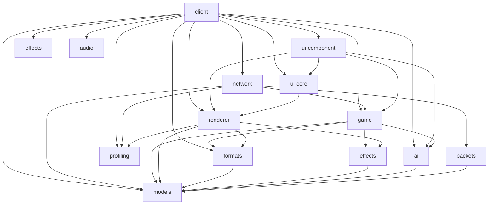
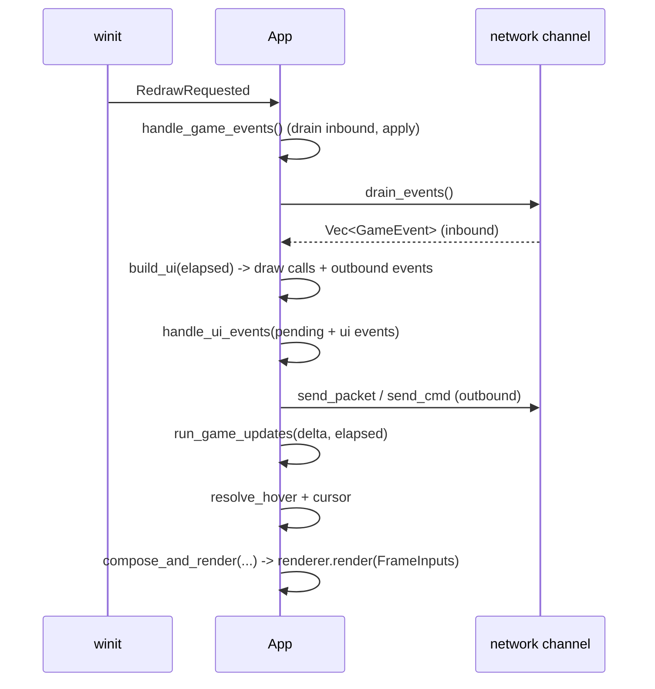
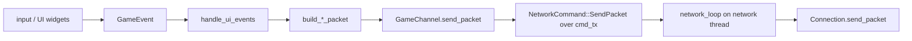
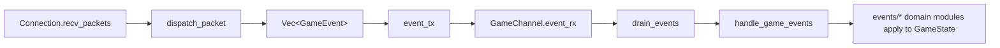

# Architecture

This document describes the runtime spine of the client: how a frame is driven,
how user actions become packets on the wire, and how server packets become
changes to game state. It also records the crate layout and the two structural
rules the refactor settled on: game code is network-agnostic, and per-frame UI
orchestration is a controller separate from the state it reads.

It reflects the code as it stands after the refactor. When the code and this
document disagree, the code is right and this document is stale; fix it.

## Crates

The workspace splits the client into library crates under `lib/` plus the
`client` binary. Two crates come from the server repository
(`../rust-ragnarok-server/lib/{models,packets}`) and are referenced by path:
`models` carries domain enums, `packets` carries wire structs and their
encode/decode.

Crate names map to directories as follows: `game` is `lib/game`
(`ragnarok-game`), `ui-core` is `lib/ui-core` (`ragnarok-ui`, the mini
immediate-mode framework), `ui-component` is `lib/ui-component`
(`ragnarok-ui-component`, the concrete widgets and windows built on the
framework), `profiling` is `lib/profiling` (`ragnarok-profiling`, a thin puffin
wrapper whose macros compile to nothing unless a feature is on). `audio` and
`profiling` have no workspace-internal dependencies.

### Game is network-agnostic

`lib/game` depends on `formats`, `effects`, `ai`, and `models`. It does not
depend on `network`, and it does not depend on `packets`. The dependency runs
the other way: `network` depends on `game`.

The rational is game state must be constructible and drivable
without a socket so that tools (viewers, headless tests) can reuse the
exact same code the client runs. `models` stays in the graph because it carries
domain enums (`ActionType`, `SkillTargetType`, `VanishType`) used across the
game, not wire structs.

`GameEvent` (the event vocabulary described below) lives in `lib/game`. It is the
shared vocabulary both directions speak, and the bottom crate owning it is what
lets game stay free of `network` while `network` and `client` both produce and
consume events.

## The frame

The entry point is `App`, which implements `winit` 's `ApplicationHandler`
(`client/src/main.rs`). `resumed` creates the window and renderer, loads the GRF,
and spawns the network thread. `about_to_wait` schedules a redraw every
`FRAME_INTERVAL` and parks until then. All per-frame work happens in
`window_event` under `WindowEvent::RedrawRequested`.

The order matters: inbound events are applied first so the frame we build and
render already reflects what the server just told us. `build_ui` produces the
draw calls for this frame and the outbound events the user's clicks generated;
`handle_ui_events` turns those into network sends; `run_game_updates` steps the
local simulation (movement interpolation, animation, effects, companion AI);
then we resolve hover, pick a cursor, and render. The render step
(`compose_and_render` into `Renderer::render`) is covered on its own in
[`rendering.md`](rendering.md).

### Outbound: client to server

User input and UI interaction produce `GameEvent`s, which `handle_ui_events`
(`client/src/main.rs`) matches and turns into network traffic. The client never
speaks packets to the UI layer; it speaks `GameEvent`s, and only the send handler
knows about packet builders.

`GameChannel` (`client/src/main.rs`) holds the two mpsc endpoints that bridge the
main thread and the network thread: `cmd_tx` for outbound commands and packets,
`event_rx` for inbound events. `send_packet` wraps a byte buffer in
`NetworkCommand::SendPacket`; `send_cmd` sends connection-control commands
(`Connect`, `Disconnect`, `SetKeepalive`). Packet byte buffers are built by the
`build_*_packet` functions re-exported from `lib/network`.

### Inbound: server to client

The network thread runs `network_loop` (`lib/network/src/lib.rs`) on a
single-threaded tokio runtime, because the packet trait objects are not `Send`.
It selects over the socket, the command channel, and the keepalive timer. For
each received packet it calls `dispatch_packet` (`lib/network/src/handler.rs`),
which decodes the packet and returns a `Vec<GameEvent>`. Those events are sent
back over `event_tx`.

On the main thread, `handle_game_events` (`client/src/events/mod.rs`) drains the
channel with `channel.drain_events()` and matches each `GameEvent`, dispatching
into the per-domain modules under `client/src/events/` (entity, combat, skill,
inventory, guild, party, quest, and so on). This is where inbound events mutate
`GameState`.

Note the two distinct roles that both feed the frame: `handle_game_events`
applies discrete server events (a spawn, a chat line, a stat change), while
`run_game_updates` (`client/src/game_updates/mod.rs`) advances continuous local
simulation every frame (interpolating movement, ticking animations and effects,
running companion AI). The event modules record what changed; the update modules
play it forward in time.

## State versus controller

`GameState` (`client/src/game_state.rs`) is the data model. Its fields are
grouped into co-access sub-structs (`Session`, `World`, `SpriteCaches`,
`AssetHandles`, `EffectKeys`, `Schedulers`, `CombatState`, `Companions`,
`PendingCasts`, `PendingConfirms`, `HoverState`, `Prefs`, `Broadcast`) so a
method can borrow one group without borrowing the whole struct.

The per-frame UI orchestration is not on `GameState`. It is a free function,
`build_in_game_ui(game: &mut GameState, windows: &mut Windows, ui, ...)` in
`client/src/ui/in_game.rs`, called from `build_ui` for the `InGame` app state.
It drives window building, minimap-marker assembly, the hotkey bar, and the
broadcast overlays. `GameState` holds state; the controller reads that state and
builds the frame.

Windows are a registry, not a match arm per window. `Windows`
(`client/src/ui/windows.rs`) owns every in-game window as a field, and the
`REGISTRY` constant maps each window's `WidgetId` to how the driver reaches its
`build`. `build_in_game_ui` iterates the frame's z-order calling each window's
`build`, then falls back to registration order for windows not yet in the
z-order. There is a single source for both id-to-window dispatch and default
z-order, replacing the two hand-synced lists that existed before.

Windows never see the client's `GameState` directly; the crate boundary forbids
`ui-component` from referencing it. Instead each `build` receives a `BuildCtx`
(`lib/ui-component/src/lib.rs`), a bundle of the specific `ragnarok-game` and
`ragnarok-ai` references a window needs (`character`, `data`, `party`, `guild`,
`companion_ai`, and so on). The controller assembles `BuildCtx` from `GameState`
each frame; any client-side state a window needs is applied by the controller
before `build`.

The app-state machine (`AppState`: `Login`, `ServerSelect`, `CharacterSelect`,
`CharacterCreate`, `InGame`) selects which UI `build_ui` runs. Only `InGame`
routes through the window registry and `build_in_game_ui`; the account screens
build their single window directly.

## Single lifecycle owner

Reset and clear policy lives in one place: `App::on_session_change`
(`client/src/events/lifecycle.rs`), keyed by a `SessionChange` value
(`MapChange`, `Logout`, `Death`, `Resurrect`). Handlers that detect a transition
keep their own work (loading a map, spawning entities, sending packets) and call
`on_session_change` for the clears, so the policy for what gets cleared when can
be read top to bottom in one function instead of being smeared across the event
modules.

This owner also holds the effect key-map invariant: clearing the effect queue and
clearing the `*_keys` maps in `EffectKeys` happen together, because a stale key
left behind blocks the matching effect from re-spawning.
