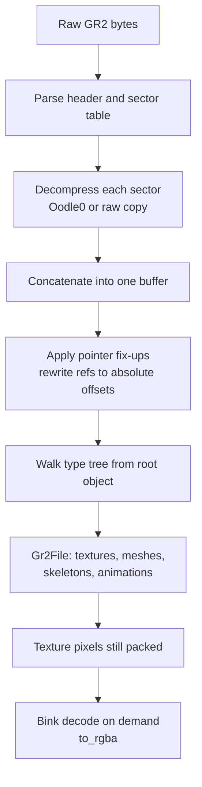
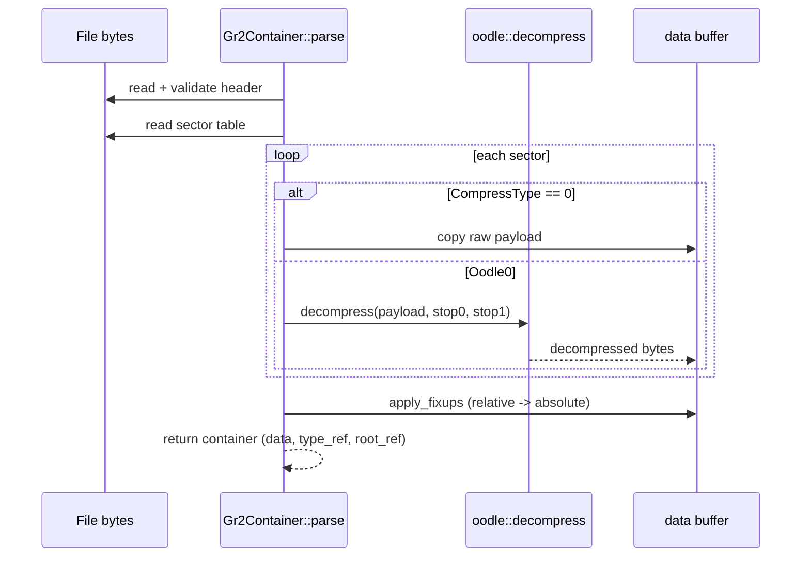
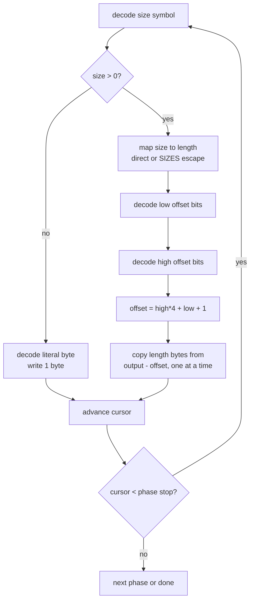
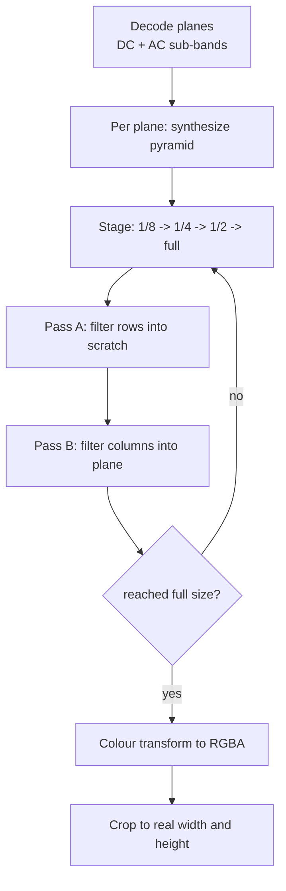
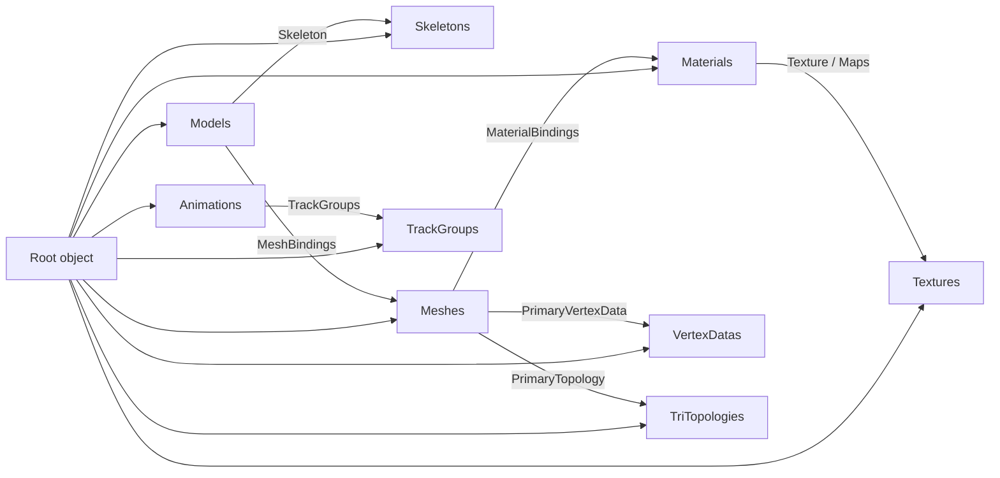

# GR2 Decoding Internals

## Acknowledgements

This work builds on prior community reverse-engineering of the GR2 format, and we
are grateful to the people who documented it. In particular the rdw-archive
RagnarokFileFormats project and its GR2 specification
(<https://github.com/rdw-archive/RagnarokFileFormats/blob/master/GR2.MD>) gave us
the container layout, the pre-processing steps, and the type-tree model, and
collected further references in one place. The Granny2-research wiki
(<https://github.com/arves100/Granny2-research/wiki/File-Format-Documentation>)
provided additional detail on the file structure. 

## Scope

This document describes how the client reads a GR2 (Granny) 3D asset, from raw
file bytes to the meshes, skeletons, textures, and animations the renderer
consumes. It covers four stages in the order they run: the container, the Oodle0
section decompressor, the shared range coder, the Bink wavelet texture codec, and
the type-tree interpreter that produces the final objects.

The external format references (rdw-archive GR2.MD and the Granny2-research wiki)
document the container and type tree. They do not document the Oodle0, range
coder, or Bink internals, so those three sections here are the authoritative
description of what the code does.

Code lives in `lib/formats/src/gr2/`:

| Module | Responsibility |
| --- | --- |
| `mod.rs` | Container: header, sector table, decompression, pointer fix-ups |
| `oodle.rs` | Oodle0 LZ-with-range-coder section decompressor |
| `range_coder.rs` | Range decoder and adaptive frequency model (shared) |
| `bink.rs` | Bink wavelet texture decoder |
| `model.rs` | Type-tree interpreter producing `Gr2File` |

## Overview

A GR2 file stores data and its schema separately. The schema is a "type tree"
that describes the layout of every object; the data is a set of compressed
sections that, once decompressed and concatenated, form one flat buffer of
objects addressed by absolute offset. Because of this separation, several
pre-processing steps run before any object can be read.



The container stage produces one decompressed buffer plus two references (the
root type and the root object). The interpreter stage walks the tree from those
references. Texture pixel data stays in its packed Bink form inside the buffer
and is decoded lazily when the renderer asks for RGBA.

## Container

### Header

The first `0x20` bytes are the signature. The file-info header follows at
`0x20`. We validate the 16-byte magic (it also encodes byte order and pointer
size; we accept the little-endian 32-bit variants of format versions 6 and 7),
confirm the reserved word at `0x18` is zero, and check the version.

| Field | Offset | Size | Type | Description |
| --- | --- | --- | --- | --- |
| Magic | 0x00 | 16 | u32[4] | Signature; identifies version 6 or 7, little-endian, 32-bit |
| Reserved | 0x18 | 4 | u32 | Must be `0` |
| Version | 0x20 | 4 | u32 | `6` or `7` |
| TotalSize | 0x24 | 4 | u32 | Must equal the file length |
| CRC | 0x28 | 4 | u32 | Reflected CRC-32 of the body |
| FileInfoSize | 0x2c | 4 | u32 | Size of the file-info header; sector table follows it |
| SectorCount | 0x30 | 4 | u32 | Number of sectors |
| TypeRef.Sector | 0x34 | 4 | u32 | Sector of the root type definition |
| TypeRef.Position | 0x38 | 4 | u32 | Offset of the root type within its sector |
| RootRef.Sector | 0x3c | 4 | u32 | Sector of the root object |
| RootRef.Position | 0x40 | 4 | u32 | Offset of the root object within its sector |

The CRC covers everything from `0x20 + FileInfoSize` (the start of the sector
table) to the end of the file. We reject the file if it fails.

### Sector table

The sector table begins at `0x20 + FileInfoSize`. Each entry is 44 bytes; we read
the fields we need:

| Field | Offset in entry | Type | Description |
| --- | --- | --- | --- |
| CompressType | 0 | u32 | `0` if stored raw, non-zero for Oodle0 |
| DataOffset | 4 | u32 | Offset of the sector payload in the file |
| CompressedLen | 8 | u32 | Compressed byte length |
| DecompressLen | 12 | u32 | Decompressed byte length |
| OodleStop0 | 20 | u32 | First Oodle phase boundary |
| OodleStop1 | 24 | u32 | Second Oodle phase boundary |
| FixupOffset | 28 | u32 | Offset of this sector's fix-up table |
| FixupCount | 32 | u32 | Number of fix-up entries |

### Decompression and fix-ups

We size the output buffer to the sum of every sector's `DecompressLen`, then
decompress each sector into its own slice of that buffer, recording the slice
start in `sector_offsets`. A raw sector is copied; an Oodle0 sector is fed
through the decompressor with its two phase boundaries.

Pointers inside a sector are stored as relative offsets. After all sectors are
in place, we apply each sector's fix-up table: every entry names a source
location and a `(sector, offset)` target, and we overwrite the 4 bytes at the
source with the absolute offset of the target within the concatenated buffer.
From this point a pointer field is a direct index into `data`.



## Oodle0 decompression

Oodle0 is an LZ scheme layered on the range coder. Each block is either a
literal byte or a `(length, offset)` back-reference into already-decoded output.
The compressed stream begins with three 12-byte parameter blocks that configure
three decode phases; the phases let the model adapt to different regions of the
output.

The 36-byte header is three parameter blocks. Each block packs two 32-bit words
that split at bit 9, plus four symbol counts:

| Field | Source | Description |
| --- | --- | --- |
| decoded_value_max | word0 & 0x1ff | Alphabet bound for literal bytes |
| backref_value_max | word0 >> 9 | Bound for back-reference offset high bits |
| decoded_count | word1 & 0x1ff | Initial literal symbol count |
| highbit_count | word1 >> 9 | Initial offset-high symbol count |
| sizes_count[4] | bytes 8..12 | Initial counts for the length models |

The range decoder starts at offset 36. We run three phases with boundaries
`[stop0, stop1, output_len]`. Each phase builds a fresh `Dictionary` (its own set
of adaptive models) from the matching parameter block and decodes blocks until
the output cursor reaches that phase's boundary.



A back-reference length is the size symbol plus one for small values, or one of
four larger lengths (`128, 192, 256, 512`) when the symbol is an escape code.
The offset is assembled from separately modeled low bits and high bits. Because
a back-reference can overlap the write cursor (the source range can extend past
the current position), we copy one byte at a time so each freshly written byte is
available to reads later in the same copy. 


```
decode_block(dict, dec, out, pos):
    size = dict.size_model[dict.prev_size].decode(dec)
    dict.prev_size = size
    if size > 0:
        length = (size < 61) ? size + 1 : SIZES[size - 61]
        low    = dict.low_model.decode(dec)          # 0..lowbit_value_max
        high   = dict.high_model.decode(dec)          # 0..backref_range/4
        offset = (high << 2) + low + 1
        src    = pos - offset
        for k in 0..length:                           # overlap-safe
            out[pos + k] = out[src + k]
        return length
    else:
        out[pos] = dict.literal_model.decode(dec) & 0xff
        return 1
```

## Range coder

Both Oodle0 and Bink draw their modeled symbols from one range decoder paired
with an adaptive frequency model. The two pieces are `Decoder` (the arithmetic
coder over a `low` / `high` / `code` interval) and `Window` (the model that
supplies symbol frequencies and rescales as it goes).

The decoder is standard range coding on 31-bit registers. `decode(total)` maps
the current interval to a cumulative frequency in `0..total`; `commit(total, val,
err)` narrows the interval to the chosen symbol's sub-range and renormalizes.
Renormalization shifts out settled leading bits (a byte, then a nibble, then
single bits) and handles the underflow straddle case where the interval brackets
the midpoint. The bitstream is least-significant-bit-first, so bytes and nibbles
are bit-reversed as they enter `code`.

The `Window` model keeps a small table of symbol values and their weights. Each
decoded symbol increments its weight; when the running total saturates
(`>= 0x4000`) we halve every weight so recent symbols dominate, drop symbols that
decay to nothing, and move the heaviest symbol into a fast-lookup slot. A
previously unseen symbol is signalled by decoding slot 0, after which the caller
reads the raw value from the stream and the window records it for next time.

```
decode_symbol(window, dec, read_raw):
    if window.total >= 0x4000: window.rebuild()
    freq = dec.decode(window.total)
    walk cumulative weights to find the symbol slot
    dec.commit(window.total, cum, weight)
    bump that slot's weight and the total
    if slot != 0: return window.values[slot]      # seen before
    else:
        v = read_raw(dec)                          # first sighting
        window.values[new_slot] = v
        return v
```

## Bink texture decoding

Textures with `Encoding == 3` store their pixels in the Bink texture codec: a
wavelet transform coded with the range coder above. This is the [RAD Bink texture](https://web.archive.org/web/20000824152455/http://www.radgametools.com/binkhCWB.htm)
format (wavelet plus range coder); it is unrelated to the Bink video format (DCT
plus Huffman) that shares the name.

A wavelet transform represents an image at several resolutions at once. Encoding
repeatedly splits the data into a coarse band (a blurred, downsampled
approximation) and a detail band (the high-frequency information the coarse band
lost). Applied recursively, this leaves one tiny coarse image plus a pyramid of
detail bands. Most detail coefficients are near zero, so they compress well.
Decoding reverses this: start from the smallest coarse band and, at each stage,
upsample and add the detail back until the plane reaches full size.

### Plane stream layout

The payload is a 4-byte prefix followed by one stream per colour plane (three
planes, or four with alpha), each parsed in turn. One plane's stream is:

```
u32 len_a                 ; byte length of the range-coded stream
u32 len_b                 ; byte length of the raw-bit stream
<range-coded stream>      ; len_a bytes, starting at offset 8
<raw-bit stream>          ; len_b bytes, starting at offset 8 + len_a
```

We read two streams in parallel and interleave them token by token: the range
decoder supplies adaptively modeled symbols, and the raw-bit reservoir supplies
fixed-width fields (scales, flags, token maxima, sign bits). The sub-bands decode
coarse to fine:

```
dc_band                   ; 1 DC band at 1/16 resolution
for shift in 4, 3, 2, 1:  ; each pyramid level, coarse first
    ac_band x3            ; horizontal, vertical, diagonal detail
row_flags                 ; threshold, then one range symbol per row
```

The per-row flags select, for the final synthesis stage, which rows carry detail
and which repeat their coarse value.

### DC and AC bands

The DC band is the single smallest, blurriest approximation image. Its samples
vary smoothly and correlate with their neighbours, so we code them predictively
(DPCM): the first sample is raw, later samples are predicted from already-decoded
neighbours (the left sample on the top row, then the average of the left and
above samples), and only the small residual is decoded.

The AC bands are the high-frequency detail added at each level, three per level.
They are residuals, so most coefficients are zero with occasional spikes. Two
techniques handle this:

- Long zero stretches are run-length coded. Two run models (`run6` and `run8`)
  decode a run of coded values followed by a run of literal zeros; the four
  largest tokens escape to bigger run lengths.
- Each non-zero coefficient is context-modeled. We predict a magnitude class from
  the surrounding decoded neighbours and decode the level with the frequency
  model for that class, then scale it and read a sign bit.

A leading 1-bit in either band flags a constant band, which we fill directly.

### Synthesis

After all bands of a plane are decoded, we reconstruct full resolution from the
pyramid. Starting at 1/8 resolution, each stage doubles the output by adding one
level of detail to the coarse band. A stage filters across rows into scratch (the
"A" pass), then down columns back into the plane (the "B" pass). The filter is a
fixed set of wavelet synthesis coefficients in Q16 fixed-point; bands too small
for the multi-tap filter's support fall back to a 2-tap Haar transform.



Finally we convert the decoded planes to RGBA. The planes hold a reversible
luma/chroma representation (the YCoCg family); the transform recovers R, G, B and
clamps to `0..255`, with alpha taken from the fourth plane when present. Because
plane dimensions are rounded up to a multiple of 16, we crop the result back to
the texture's real width and height.

Tiny textures (`width * height <= 0x100`) skip the wavelet codec: their pixels are
stored raw and only need the output-layout conversion, which is the identity for
RGBA8888.

## Type-tree interpretation

With the buffer decompressed and fix-ups applied, `Gr2File::parse` walks the type
tree. A type definition is a list of members, each 32 bytes, terminated by an
`End` member. A member carries its type tag, an optional name pointer, a
reference offset (the element type for arrays, and so on), and an array width.



We resolve members to byte slots by walking the member list and advancing a
cursor by each member's size; sizing is recursive for inline members, so we cache
computed type sizes. Reading a field then means reading a scalar, string, array,
or transform at its slot.

We parse each top-level collection into a vector and record the file offset of
every element. Cross-references between collections are stored as file offsets,
so we build an offset-to-index map per collection and resolve references through
it (an O(1) lookup rather than a scan). Materials need one extra step: a
sub-material that binds no texture directly inherits one through a referenced map,
and a map may itself be such a parent, so we iterate to a fixed point to follow
the chain.

The result is `Gr2File`: textures (pixels still packed for lazy Bink decode),
materials, skeletons, vertex data, triangle topologies, meshes, models, track
groups, and animations, with all cross-references resolved to vector indices.
