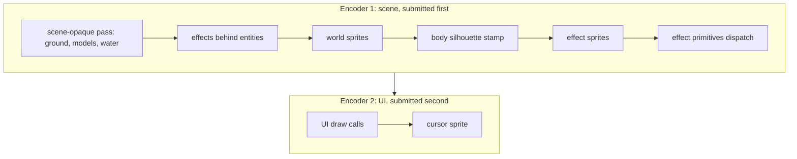

# Rendering pipeline

This document describes how one frame is drawn: what the client hands to the
renderer, the order of render passes, and how the effect draw path turns a list
of primitives into GPU draw calls. It covers `lib/renderer`, entered from the
client's `compose_and_render`.

It reflects the code as it stands after the refactor. When the code and this
document disagree, the code is right and this document is stale; fix it.

For the coordinate conventions used throughout (native RO axes, negative Y is
up, camera placement [read more at ragnarokresearchlab.github.io](https://ragnarokresearchlab.github.io/rendering/coordinate-systems/). For the effect primitives named below, see the module docs under
`lib/renderer/src/effect/primitives/`. For how a world position becomes the
screen anchor, depth, and gradient the sprite passes consume, see
`sprite-projection.md`.

## Entry point

The client assembles everything the renderer needs for a frame into a
`FrameInputs` (`lib/renderer/src/lib.rs`) and calls `Renderer::render`.
`compose_and_render` (`client/src/scene/mod.rs`) is where this happens: it runs
the effect frame composition (`compose_effect_frame`) to produce the effect
batches, sprite-particle records, and the `EffectDrawList`, then hands them over
alongside the world sprite batches, cursor batches, and UI draw calls.

`FrameInputs` carries nine fields:

- `ui_draw_calls`: 2D UI geometry, already laid out in logical pixels.
- `sprite_batches`: world entity sprites (players, monsters, NPCs).
- `silhouette_batches`: flat feet-depth body stamps used to occlude effects.
- `effect_sprite_batches`: sprite-based effect frames drawn in screen space.
- `effect_draws`: the `EffectDrawList` of procedural primitives.
- `sprite_particle_records`: pre-built effect draw records for sprite particles.
- `cursor_batches`: the mouse cursor sprite.
- `inline_textures`: transient bind groups referenced by index from UI calls.
- `elapsed`: seconds since start, for time-driven shaders (water, effects).

`render` acquires the surface texture, then delegates to `render_into` with the
color view, the depth view, and the clear color. `render_into` holds the whole
frame; the rest of this document walks it.

## The frame

`render_into` records two command encoders and submits them separately: one for
the 3D scene and its effects, one for the UI on top. Splitting the submit keeps
the UI encoder off the scene's depth buffer and lets the UI draw over whatever
the scene produced.



Before recording, `render_into` resizes the sprite, effect-sprite, and UI
renderers to the current logical size, uploads the camera to
`global_uniforms`, and ticks the water animation with `elapsed`.

`render` normally hands the surface view straight to `render_into`. While
[`ScreenDistortion`](../../lib/renderer/src/screen_distortion.rs) is active
(Hallucination) it instead points `render_into` at an offscreen colour target of
the same size and format, then draws that texture to the surface through a
third encoder, resampled with a per-scanline horizontal sine offset — so the
ripple covers the UI and cursor too. Inactive, the offscreen target is released
and the path is byte-for-byte the old one.

### Scene opaque pass

The first pass clears the color target to the clear color and the depth buffer
to 1.0, then draws the world back-to-front-independent geometry with depth
testing. What it draws depends on `background_mode`:

- `RswMap` (the normal in-game case): ground, then the map's static models, then
  per-skill-unit models, then animated GR2 models (emperium, guardians), then
  the grid selector(this is a debug feature available by pressing `F11`), then water. Each reads the shared camera uniform
  (`global_uniforms`) and the texture cache.
- `GroundProxy`: a single proxy ground plane, used when no map is loaded.
- `Clear`: nothing, leaving just the clear color.

All later passes in this encoder load the existing color and depth
(`LoadOp::Load`); only this first pass clears.

### Transparent and effect passes

After the opaque scene, still in the first encoder, we draw the transparent
layers in a fixed order chosen so effects occlude correctly against entity
bodies:

1. Effects flagged behind entities (`effect_draws.behind`) go first, so they sit
   under the sprites. They run through the same effect build-and-dispatch path
   described below.
2. World sprites (`sprite_batches`) draw with depth testing.
3. The body silhouette (`silhouette_batches`) stamps a flat feet-depth mask.
   Sprites write no per-pixel depth of their own, so this stamp is what makes
   the following effect layers occlude against the body: effects above the feet
   draw on top, ground effects at the feet are hidden.
4. Effect sprites (`effect_sprite_batches`) draw next.
5. The procedural effect primitives (`effect_draws` plus
   `sprite_particle_records`) are built into draw records and dispatched.

The first encoder is then submitted. A second encoder draws the UI
(`ui_draw_calls`, resolved to bind groups against the font atlas, the white
texture, the texture cache, or an inline texture) and finally the cursor sprite
with no depth buffer. That encoder is submitted second.

## The effect draw path

Effects do not each own a draw call. They emit primitives into an
`EffectDrawList`, and the renderer turns the whole list into one batched pass.
There are three stages: build, batch, dispatch.


### Build: primitives to records

`build_effect_records` (`lib/renderer/src/lib.rs`) walks the draw list and
produces a flat `Vec<DrawRecord>`. Each `DrawRecord` (`effect/queue.rs`) holds
the vertices and indices for one primitive, its `PipelineKind`, its
`BlendBucket`, a depth anchor (`view_z` of an anchor point), an `emission_index`
(the primitive's position in the list, used as a stable tie-break), and the
texture bind group resolved from the cache.

Two sources feed the records:

- Billboards are built directly by `prepare_billboard_records`, because they
  share the sprite pipeline (`PipelineKind::Sprite`) and need the screen
  dimensions to project.
- Every other primitive comes from the `EffectPrimitiveRegistry`: the renderer
  iterates the registry and calls each renderer's `prepare`. The registry is an
  array indexed by `PipelineKind`, holding one boxed `EffectPrimitiveRenderer`
  per kind (`effect/registry.rs`). This is what replaced the hand-threaded list
  of renderer fields: adding a primitive means adding one registry slot and one
  trait impl, not editing every call site.

The texture lookup resolves a name to a bind group through
`effect_texture_path` (supporting `|`-separated fallback candidates) against the
texture cache, falling back to the 1x1 white bind group when a texture is
missing.

### Batch: partition and sort

`dispatch` (`effect/dispatch.rs`) first concatenates every record's vertices and
indices into one vertex buffer and one index buffer (reallocated to the next
power of two only when the frame outgrows them). It then calls
`partition_and_sort` (`effect/queue.rs`), which splits the records into the five
`BlendBucket`s and, within each bucket, sorts by depth then `emission_index`.

The five buckets flush in a fixed order (`BlendBucket::FLUSH_ORDER`):

```
Alpha, AlphaNoDepth, Additive, AdditiveNoDepth, Multiply
```

Alpha-blended geometry draws before additive so additive light sits on top of
it, and the `NoDepth` variants let a primitive opt out of depth testing while
keeping its place in the blend order.

### Dispatch: one pass, minimal state changes

All buckets draw in a single render pass that loads (does not clear) the scene
color and depth. The dispatcher walks the sorted spans and changes GPU state
only when it must:

- Bind group 0 is either the sprite uniform (screen-space orthographic, for
  `PipelineKind::Sprite`) or the camera uniform (3D view-projection, for every
  other kind). The dispatcher switches group 0 only when crossing between those
  two families.
- The render pipeline is selected by `pipeline_for`, which maps
  `(PipelineKind, BlendBucket)` to a concrete pipeline: `Sprite` uses the sprite
  renderer's pipelines, every other kind asks its registry renderer's `pipeline`
  method. The pipeline is re-set only when the kind or bucket changes.
- The texture bind group (group 1) is set per span, then the span's index range
  is drawn.

Because the records are already sorted into runs of the same kind and bucket,
consecutive spans usually share a pipeline, so the pass issues far fewer state
changes than draw calls.

## Blend and depth model

`BlendKind` on a primitive (`Alpha`, `Additive`, `Multiply`, or a `Raw` src/dst
pair) is classified into a `BlendBucket` by `BlendBucket::from_blend_kind`; a
`Raw` blend with destination factor 6 is treated as alpha, otherwise as
additive. The `NoDepth` buckets are produced when a primitive sets its
`no_depth` flag.

Effect pipelines never write depth. Most compare `LessEqual` so they occlude
against the scene and the body silhouette; the `NoDepth` pipelines compare
`Always`, and the full-screen overlay pipeline compares `Always` and forces its
records to the far depth so overlays sort last. The opaque scene pass is the
only place depth is written.

Effect pipelines are built through a shared helper (`build_pipeline` with
`PipelineOpts`, in `effect/pipeline.rs`) and the single additive `BlendState`
constant in `effect/blend.rs`, so each primitive renderer declares only its
shader, topology, cull, and depth-compare knobs rather than repeating the wgpu
scaffolding.

## Where to look

- Frame path and pass order: `Renderer::render` / `render_into`
  (`lib/renderer/src/lib.rs`).
- Client-to-renderer boundary: `compose_and_render` (`client/src/scene/mod.rs`).
- World-to-screen sprite placement: `sprite-projection.md` and
  `lib/renderer/src/sprite_projection.rs`.
- Effect record building: `build_effect_records` (`lib/renderer/src/lib.rs`).
- Full-frame post-process: `screen_distortion.rs`.
- Batching, sorting, dispatch: `effect/dispatch.rs`, `effect/queue.rs`.
- Primitive registry and the renderer trait: `effect/registry.rs`.
- Per-primitive geometry and blend: the module docs in
  `lib/renderer/src/effect/primitives/`.
- Shared pipeline construction: `effect/pipeline.rs`, `effect/blend.rs`.
