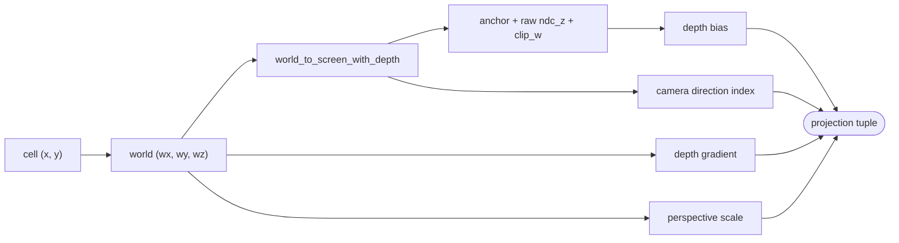

# Sprite projection

This document describes how a world-space entity or effect becomes the flat
screen-space quad the sprite pass draws, and how that quad still sorts correctly
against the 3D scene. It covers `lib/renderer/src/sprite_projection.rs`, which
is the shared entry point for both world entity sprites and sprite-based
effects.

It reflects the code as it stands after the refactor. When the code and this
document disagree, the code is right and this document is stale; fix it.

For the coordinate conventions used throughout (native RO axes, negative Y is
up, camera placement  [read more at ragnarokresearchlab.github.io](https://ragnarokresearchlab.github.io/rendering/coordinate-systems/).). The short version, and the only part that matters here: world
coordinates are native RO, so up is negative Y, and a point one unit above the
ground is `wy - 1.0`.

## The problem

A sprite is a billboard: a flat, camera-facing quad. But it shares the depth
buffer with the ground, water, and models, so it has to be placed in 3D depth,
not just painted on top. Two things make that awkward.

First, a billboard has no real geometry, so every pixel would naively carry a
single depth value. A sprite standing on sloped ground, or a ground-lying
effect stretching away from the camera, needs its depth to vary across the quad
or it sorts wrong.

Second, a sprite standing on a cell sits at almost exactly the ground's depth at
that cell, so it z-fights with the floor it stands on.

`sprite_projection.rs` solves both while producing everything the sprite pass
needs from one call.

## What a projection returns

`project_entity_screen` (from a map cell) and `project_world_screen` (from a raw
world point) both return the same tuple:

```
([sx, sy], ndc_z, camera_dir, sprite_scale, grad)
```

- `[sx, sy]`: the screen anchor in pixels, top-left origin, Y pointing down.
- `ndc_z`: the depth at the anchor, biased toward the camera (see below).
- `camera_dir`: which of the 8 facing frames to draw, `0..=7`.
- `sprite_scale`: pixels-per-sprite-pixel at this depth.
- `grad`: the depth gradient across the quad, `[dz/dsx, dz/dsy]`.



## Cell to world

`MapCoordinates::cell_to_world` maps a cell to world X and Z but always returns
`wy = 0.0`; the real height comes from the GAT. So the world point is assembled
in two steps:

```
(wx, _, wz) = coords.cell_to_world(cell_x + 0.5, cell_y + 0.5)
wy          = gat.get_height(cell_x + 0.5, cell_y + 0.5)   // 0.0 if no GAT
```

We address the cell by its centre (`cell + 0.5`) so an entity projects to the
middle of its cell rather than a corner. `cell_world_pos` exposes this world
point on its own, for callers that only need the position.

## Depth at the anchor

The camera returns a raw NDC z (near plane at 0, far plane at 1, the wgpu
perspective convention). We pull the sprite a fixed number of world units toward
the camera before using it:

```
ndc_z = ndc_z_raw - near * ENTITY_DEPTH_BIAS_UNITS / clip_w^2
```

`clip_w` is the view-space distance to the point, so the correction is large up
close and shrinks with distance. That is exactly what we want: it lifts a sprite
clear of the ground cell it stands on without noticeably reordering sprites that
are far from the camera. `ENTITY_DEPTH_BIAS_UNITS` lives in `effect_sprite.rs`.

## Depth gradient

A billboard spans a range of pixels, and each pixel should carry the depth of
the world it covers. We approximate the depth across the quad as a plane in
screen space, anchored at the projection point:

```
z(sx, sy) ~= z0 + grad.x * (sx - sx0) + grad.y * (sy - sy0)
```

To find `grad` we pick two world-space directions away from the anchor, project
both, and measure how screen position and depth move along each. That gives a
2x2 system we solve for the two gradient components.

The two directions differ by what the sprite is:

- An upright billboard (`depth_gradient`) uses "up" (`wy - 1.0`, remember up is
  negative Y) and camera-right. The depth plane then follows the standing quad.
- A ground-lying effect (`ground_depth_gradient`) uses two directions that both
  stay on the ground plane: camera-right, and camera-forward projected onto the
  ground (`fwd = (right.z, 0, -right.x)`). Depth then interpolates across the
  floor instead of up a wall.

With screen deltas `(a, b)` and depth delta `e` along the first direction, and
`(c, d)`, `f` along the second:

```
det    = a*d - b*c
grad.x = (e*d - b*f) / det
grad.y = (a*f - e*c) / det
```

If `det` is near zero the two directions collapsed to one line on screen
(the sprite is edge-on), and we return a flat `[0, 0]` gradient rather than
dividing by a degenerate determinant.

`entity_ground_gradient` is the ground-lying variant exposed on its own, for
effects that lie on the floor at an entity's cell.

## Scale

`sprite_scale` converts a sprite authored in its own pixel units into
on-screen size:

```
sprite_scale = perspective_scale(wx, wy, wz) * coords.zoom() / 75.0
```

`Camera::perspective_scale` returns pixels-per-world-unit at the point's depth
(it reads the projection matrix's vertical focal term and divides by `clip_w`).
Multiplying by the map zoom and dividing by the reference sprite pixel size of
75 lands the sprite at the correct size for the current camera distance.

## Facing frame

`camera_dir` comes from `Camera::direction_index`: the camera yaw folded into
one of 8 octants, `0=S, 1=SW, 2=W, 3=NW, 4=N, 5=NE, 6=E, 7=SE`. The sprite pass
uses it to pick which of the 8 pre-rendered facing frames to draw, so a sprite
turns to face the camera as the camera orbits.

## Where to look

- Projection entry points and the math: `lib/renderer/src/sprite_projection.rs`.
- Camera projection primitives (`world_to_screen_with_depth`,
  `perspective_scale`, `right_vector`, `direction_index`):
  `lib/renderer/src/camera.rs`.
- Cell-to-world mapping and zoom: `lib/formats/src/map_coordinates.rs`.
- The depth-bias constant: `ENTITY_DEPTH_BIAS_UNITS` in
  `lib/renderer/src/effect_sprite.rs`.
- Where the results are consumed: the sprite and effect-sprite passes described
  in `rendering.md`.
