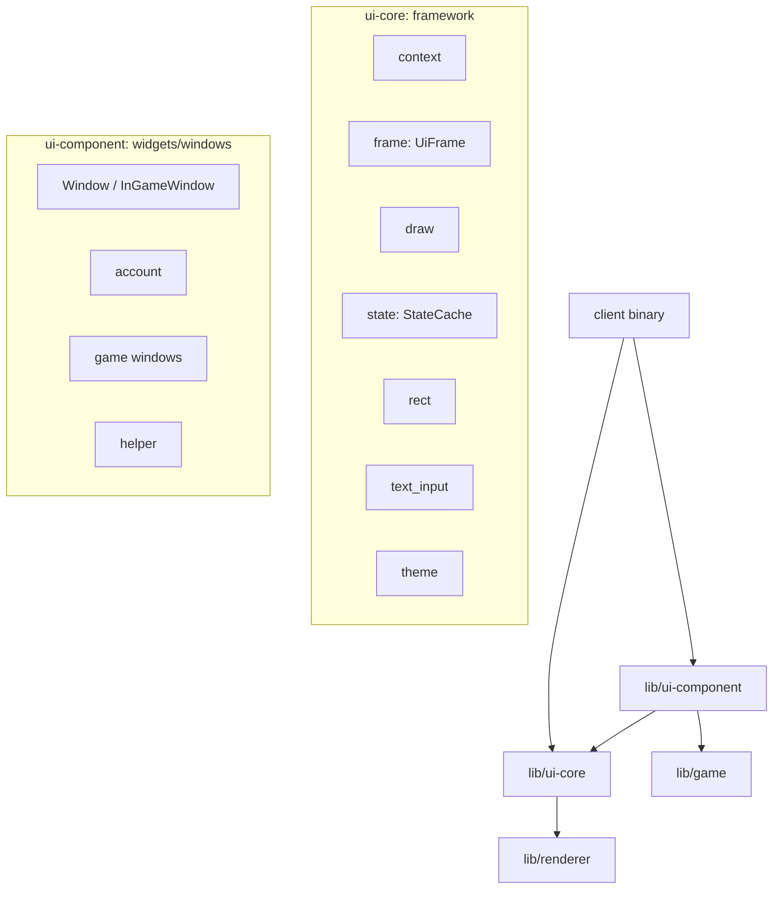
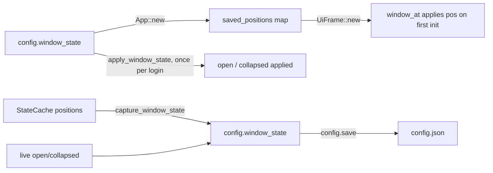
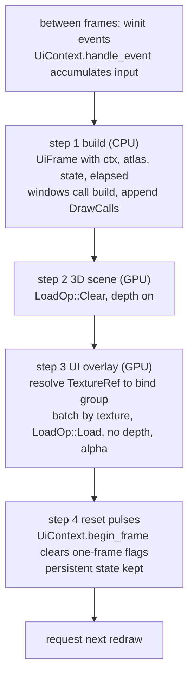

# UI system

This document is the single source of truth for the UI framework: the two-crate
split, the immediate-mode contract, the per-frame widget API, input handling, how
windows are registered and z-ordered, and how window layout is persisted. It also
covers how textures flow from GRF files to the screen.

It reflects the code as it stands after the refactor. When the code and this
document disagree, the code is right and this document is stale; fix it.

There is no UI version or ABI mechanism, and nothing in the code consumes one.
Do not add one.

## Two crates

The UI is split across two crates.

- `lib/ui-core` is the framework: the mini-egui layer that knows how to turn
  input plus widget calls into draw geometry. Its modules are `context`,
  `frame`, `draw`, `rect`, `state`, `text_input`, and `theme`. It has no
  knowledge of any specific window.
- `lib/ui-component` is the widgets and windows built on the framework: the
  `Window` and `InGameWindow` traits (`lib/ui-component/src/lib.rs`), the
  concrete windows under `account/` and `game/`, and shared widget helpers under
  `helper/` (dropdown, scrollbar, dialog container, window chrome, and so on).

The client binary owns the instances and drives them: `client/src/ui/windows.rs`
holds every window in one `Windows` struct and the dispatch registry;
`client/src/ui/in_game.rs` builds the in-game frame.



`ui-core` produces `DrawCall` values carrying an abstract `TextureRef` (a
texture name or an atlas handle, never a GPU resource). `DrawCall` and
`TextureRef` are plain data types defined in `lib/renderer` and re-exported
through `ui-core`'s `draw` module (`UiDrawCall` / `UiTextureRef`). The renderer
resolves each `TextureRef` to a wgpu bind group at render time, so the framework
stays free of GPU state.

## The immediate-mode contract

The framework keeps no retained widget tree. Every frame, all UI geometry is
rebuilt from scratch by calling widget methods on a fresh `UiFrame`; there is no
persistent scene graph the framework diffs, and no widget objects it owns.

The only state `ui-core` carries across frames is the `StateCache`. That cache
holds per-widget framework state (window positions, drag, z-order, focus, scroll,
popup rects) keyed by widget id, not a tree of widgets. See
[StateCache](#statecache).

Window structs in `ui-component` are long-lived and hold their own fields (a
`TextInput`, an open flag, a selected index). That is application state owned by
the caller, not framework state: the framework only ever sees a per-frame `build`
call plus the `StateCache` handed to it. Nothing about a window survives in the
framework between frames.

## Input handling

Input flows in one direction: winit delivers events, `UiContext` accumulates
them into flat fields, and widgets read those fields during `build`. There is no
event queue, no dispatch layer, and no listener registration. A widget "handles"
input by looking at the context when it is built and deciding what to do.

### Ingestion

`UiContext` (`context.rs`) is a frame-scoped input accumulator. The client calls
`UiContext::handle_event` for every winit `WindowEvent` (`main.rs`), and it folds
each event into a field:

- Cursor moves store the pointer in logical pixels (the physical position divided
  by `dpi_scale`).
- Left press sets `mouse_clicked` and `mouse_down`, and detects a double click
  when a second press lands within 400 ms and 5 px of the last
  (`mouse_double_clicked`). Release clears `mouse_down`.
- Right press sets `mouse_right_clicked`.
- `ModifiersChanged` tracks `ctrl_pressed`, `shift_pressed`, `alt_pressed`.
- Keyboard press sets the named-key flags (`key_enter`, `key_tab`, `key_escape`,
  arrows, backspace, delete) from the logical key, and the function-key flags
  (`key_f1` and so on) from the physical scancode. Function keys are matched on
  the physical code because some layouts deliver an Fn-remapped logical key that
  a named-key match would miss. Character input is appended to `typed_chars`.
- A paste chord (Ctrl+V or Shift+Insert) reads the system clipboard through
  `arboard` and pushes the text into `typed_chars`, dropping control characters.
- The mouse wheel accumulates into `scroll_delta`; resize updates the logical
  screen size.

### The pulse model

The context holds two kinds of state:

- Persistent state that survives across frames: mouse position, `mouse_down`,
  screen dimensions, modifier flags, `dpi_scale`. `begin_frame()` never clears
  these.
- One-frame pulses cleared every frame: `mouse_clicked`, `mouse_double_clicked`,
  `mouse_right_clicked`, `typed_chars`, `scroll_delta`, and the key flags. These
  fire once and must be consumed before `begin_frame()` clears them.

The clear happens after the frame is built and rendered, not before, so a click
survives from `handle_event` through `build` to the widget that reads it. See
[Rendering cycle](#rendering-cycle) for the exact ordering. This is why a
discrete action ("user clicked") uses `mouse_clicked` while a held-button visual
uses `mouse_down`.

### Hit testing and occlusion

`UiFrame::interact(id, rect)` is the one place input becomes interaction. It
reports the rect hovered only when the pointer is inside it and the pointer is
not blocked: a window lower in the z-order under the hovered window is occluded,
a modal layer blocks everything outside it, and an open popup layer (context
menu, dropdown) blocks the pointer beneath it. A click inside an interacting rect
sets focus to its id. Every widget builds on `interact`, so this gating is
uniform.

While building, `UiFrame` also records whether the pointer is over any widget
(`any_hovered`) and over any interactive widget (`any_interactive_hovered`).

### Focus and keyboard navigation

Focus is a single `WidgetId` held on the `UiFrame` and mirrored into the
`StateCache` (`FocusState`) so it survives across frames; a fresh `UiFrame` reads
it back as its starting focus. `set_focus(id)` and `focused()` are the accessors,
and a click routes focus through `interact`. A window with several focusable
fields cycles them itself: it reads `key_tab`, advances an internal focus enum,
calls `set_focus`, then after building syncs back from `focused()` in case a
click moved focus in the meantime.

### Escape and Enter routing

Escape and Enter each resolve to exactly one action per press.

`UiFrame::take_escape()` is a single-consumer read: the first caller in a frame
gets `true`, later callers get nothing, and `escape_pressed()` reports the same
answer without consuming. In-game windows never read `ctx.key_escape`; they
declare `wants_escape` / `on_escape` and the client's `route_escape`
(`client/src/ui/escape.rs`) runs the chain before the window build loop:

1. the chat input, if focused - Escape drops the line, and a 200 ms guard keeps
   the same press from also dismissing a window
2. a pending skill target, pet capture, or pet roulette
3. the front-most modal: context menu, transient dialogs, confirm dialog, item
   info, system menu, item list, warp list, NPC shop, NPC dialog
4. registry windows walked front-to-back through the z-order, first claimant wins
5. the current attack target
6. otherwise the system menu opens - never while dead, so the respawn UI cannot be
   dismissed

`custom.window.exclude_close_via_esc` lists windows step 4 must skip, by the names
in `ESC_WINDOW_NAMES`; Escape then reaches whatever is behind them. Server-driven
modals are deliberately not listable - they must stay answerable.

Enter uses the same idea with the existing keyboard block: after the Escape chain,
`modal_owns_keyboard` asks every window's `owns_keyboard` and calls
`UiFrame::block_keyboard()`, which suppresses `enter_pressed()` and
`escape_pressed()`. Modals keep reading `ctx.key_enter` directly; anything that
must lose to a modal - today the chat activate and send paths - reads
`enter_pressed()`.

### Text editing

A text field owns a `TextInput` (`text_input.rs`). Its `process_keys(ctx)`
consumes the frame's `typed_chars` and the editing key pulses (backspace, delete,
arrows) and updates the buffer and cursor. Password fields mask their
`display_text`. Because pasted text arrives as `typed_chars`, paste needs no
special path in the field.

### Item drag and drop

Dragging an item between slots (inventory, cart, storage, trade) runs through a
`DragState` in the `StateCache`, shared by all slots under one reserved id.

```text
drag_source(id, index, icon, size)   // press on a slot: arm a pending drag
draw_drag_icon()  each frame:
    if mouse released:
        end the drag; if it was active, return DragCancelledInfo
    else if pending and moved past the 5 px threshold:
        promote to active
    if active:
        draw the icon at the cursor
drop_zone(rect)                      // release over a target: return (source_id, index), end drag
```

A drag promotes from pending to active only after the pointer moves past a
threshold, so a plain click on a slot is not a drag. A release over a `drop_zone`
completes the move; a release anywhere else cancels and `draw_drag_icon` returns
`DragCancelledInfo`. The caller uses that to implement drop-outside behavior:
when an inventory drag is cancelled and `hovered_window()` is `None`, the item is
dropped on the floor (`client/src/ui/in_game.rs`).

### Separating UI input from world input

The world reacts to the same mouse the UI does, so the client must not move the
character when the click was meant for a window. `build_ui` returns the frame's
`any_hovered` and `any_interactive_hovered` flags, and the world hover and click
resolution suppresses itself when either is set (alongside its own conditions
like a held right button). The pointer being over a window therefore blocks
world picking for that frame without either side knowing about the other.

## UiFrame: the per-frame widget API

`UiFrame` (`frame.rs`) is constructed once per frame and borrowed by windows and
widgets to build their UI. It is created with `UiFrame::new(ctx, atlas, state,
elapsed_secs, has_grf_textures, initial_focus, saved_positions)`.

Key fields:

- `ctx: &UiContext` - the input for this frame.
- `state: &mut StateCache` - the retained widget state, owned by `App`.
- `draw_calls: Vec<DrawCall>` and `tooltip_draw_calls: Vec<DrawCall>` - widgets
  append geometry here.
- `has_grf_textures: bool` - whether GRF UI textures loaded, so widgets pick
  textured or fallback rendering.
- `saved_positions` - the map of saved window positions applied on a window's
  first appearance (see [Layout persistence](#layout-persistence)).

Internally `UiFrame` also tracks the current window, the hovered window, the
z-order snapshot, focus, and modal layers for the frame.

### Widget pattern

Every widget is a method on `UiFrame` that reads input from `self.ctx`, computes
its interaction state, appends `DrawCall`s to `self.draw_calls`, and returns a
`Response`. Callers check the response immediately after the call. `Response`
exposes `clicked()`, `hovered()`, `has_focus()` and similar; its fields are
private so new ones can be added without breaking callers.

`UiFrame::interact(id, rect)` is the primitive underneath all interactive
widgets: it hit-tests a rectangle, manages focus, and returns a `Response`. Use
it directly for custom interactive regions (list rows, and so on) rather than
duplicating hover and click logic.

### Widget ids

`WidgetId(u32)` identifies a widget for focus tracking and `StateCache` lookups.
Ids must be unique within a screen or window. Define them as constants. All
interactive widgets (`button`, `text_input`, `interact`) take an id.

### Dual rendering

Widgets support both GRF-textured and plain fallback rendering by checking
`self.has_grf_textures`. Textured mode draws quads with `TextureRef::Named(path)`;
fallback mode draws a solid color plus border with `TextureRef::White` using the
palette in `theme.rs`. The client is usable without GRF data files.

## StateCache

`StateCache` (`state.rs`) is a type-erased map from `(WidgetId, TypeId)` to
`Box<dyn Any>`. `get_or_default::<T>(id)` returns a mutable `T`, creating it on
first use; `get`, `set`, and `clear` round it out. `App` owns the single
instance (`ui_state_cache`) and passes it into each `UiFrame`.

This is the one thing the framework retains across frames. It holds the
framework's per-widget state, including:

- `WindowState` per window id: position (`x`, `y`), an `initialized` flag, and
  drag bookkeeping.
- `ZOrder` (under a reserved id): the window stacking order (see
  [Z-order](#z-order)).
- Window rects and popup-blocker rects from the previous frame, used for
  hover and occlusion.
- Focus state, scroll offsets, and similar small per-widget values.

`extract_window_positions()` pulls every `WindowState` position out as a
`HashMap<u32, [f32; 2]>` for persistence.

Note that this is retained widget state, not a retained widget tree: the cache
stores values keyed by id, and the widgets that read them are rebuilt every
frame.

## draw, rect, theme, text_input

- `draw.rs` holds the geometry helpers that build `DrawCall`s: solid quads
  (`quad_vertices`), UV sub-region quads (`quad_vertices_uv`), rotated and
  gradient quads, rounded rectangles, text (`text_vertices`,
  `text_vertices_clipped`, `colored_text_vertices`), color-code parsing, and
  word wrap. A `DrawCall` carries screen-space vertices (pixels, top-left
  origin), local indices, and a `TextureRef`; the renderer re-indexes when
  batching.
- `rect.rs` is the `Rect` type (`x`, `y`, `w`, `h`) plus layout helpers
  (`contains`, `centered_in`, button and dialog alignment).
- `theme.rs` is the fallback palette (`FallbackPalette` color constants and
  `CORNER_RADIUS`) used when GRF textures are absent.
- `text_input.rs` is `TextInput`, the retained text-editing state for a field
  (buffer, cursor, password masking): `process_keys` consumes the frame's key
  pulses, `display_text` and `display_cursor_offset` drive rendering.

## Windows: the Window and InGameWindow traits

`lib/ui-component/src/lib.rs` defines the window contract.

`Window` is the base:

- `has_grf_textures` / `set_has_grf_textures` - GRF texture availability.
- `set_texture_sizes(size_fn)` - adopt real GRF texture dimensions for layout.
- `window_size()` - nominal outer size; the default `(0.0, 0.0)` marks a window
  that positions itself (bars, dialogs, full-screen screens).
- `grf_texture_paths()` - the static list of GRF textures to preload.

`InGameWindow: Window` adds the per-frame behavior:

- `setup_modal(ui)` - declare modal layering before the frame builds.
- `build(&mut self, ui: &mut UiFrame, ctx: &mut BuildCtx) -> Vec<GameEvent>` -
  build this window's UI for the frame and return the game events it produced.
- `wants_escape(ctx)` / `on_escape(ctx)` - claim and handle Escape. Default
  `false` / no-op, so bars and notifications stay out of the router.
- `owns_keyboard(ctx)` - this window is answering Enter (a modal awaiting OK, or a
  nested input dialog). Default `false`.

`BuildCtx` is the live game state a window reads during `build`: character, data
table, party, friends, guild, quest log, companions, pet, companion AI config,
and the local account and character ids. It borrows `ragnarok_game` and
`ragnarok_ai` data directly each frame, with no snapshot and no per-frame clone.
The crate boundary forbids `ui-component` from referencing the client's
`GameState`, so anything that lives client-side is applied by the caller before
`build`.

## Window registry

`client/src/ui/windows.rs` is the single place that lists windows and how to
reach them.

- `Windows` is a struct holding every window instance. It is created once and
  retained; each field is one long-lived window.
- `REGISTRY: &[(WidgetId, Dispatch)]` maps a window id to the accessor that
  reaches its `build`. `Dispatch::Trait` holds a function pointer returning a
  short-lived `&mut dyn InGameWindow`; `Dispatch::VendingAvailable` is the
  special second view onto `vending_setup_window` (its `build_available`), which
  cannot also appear as a `&mut dyn` accessor of the same field.
- The registry is the single source for both id-to-window dispatch and the
  fallback build order. Its order is back-to-front for windows that have not yet
  registered themselves in the frame's z-order.

`build_in_game_ui` (`client/src/ui/in_game.rs`) drives a frame:

```text
z_order = ui.get_z_order()
ui.compute_hovered_window(z_order)     // from previous frame's rects
for id in z_order:                     // stacked windows, back to front
    dispatch_window(id)
for (id, _) in REGISTRY:               // windows not yet in the z-order
    if id not in z_order:
        dispatch_window(id)
```

`dispatch_window` looks the id up in `REGISTRY` and calls the matching accessor's
`build` (or `build_available` for `VendingAvailable`), collecting the returned
`GameEvent`s.

## Z-order

Window stacking lives in the `StateCache` as a `ZOrder` value (`frame.rs`), under
a reserved widget id.

`ZOrder` holds `order: Vec<(WidgetId, WindowOrder)>` and a `pending_front`.
`WindowOrder` is a three-band enum ordered `Middle < Foreground < Tooltip`;
`sorted_ids()` concatenates the bands so a `Foreground` window always sorts above
any `Middle` window regardless of insertion order, and `Tooltip` above both.

The API:

- `ensure_in_z_order(id)` / `ensure_in_z_order_with(id, order)` register a window
  the first time it appears, in the given band (default `Middle`).
- `bring_to_front(id)` records `pending_front`; the actual reorder happens on the
  next `get_z_order()`, which moves that id to the top of its band.
- `is_topmost(id)` reports whether a window is last in the order.

`window_at` (the standard draggable-window helper) ties it together: it registers
the window, applies a saved or default position on first use, handles dragging,
enters the window rect for the frame, and calls `bring_to_front` when the window
is clicked and not occluded. `compute_hovered_window` walks the z-order top-down
against the previous frame's rects to find the hovered window, and
`is_window_occluded` uses that plus any modal layers to block input to windows
underneath.

## Layout persistence

Window layout persists through `config.json`. `WindowStateEntry`
(`client/src/config.rs`) records `position`, `open`, and `collapsed` per window
id, stored as `Config::window_state: HashMap<u32, WindowStateEntry>`.



Restore has two parts:

- Positions. `App::new` builds a `saved_positions` map (id to `[x, y]`) from
  `config.window_state` and hands it to every `UiFrame`. `window_at` applies the
  saved position the first time a window appears (guarded by the `initialized`
  flag on `WindowState`), so a saved position never fights an active drag.
- Open and collapsed. `GameState::apply_window_state` applies the open and
  collapsed flags for the windows that have them (inventory, equipment, skills,
  chat). It runs once per login, guarded by `window_state_restored`, which is
  reset on `SessionChange::Logout`.

Capture is the reverse. `capture_window_state` (`client/src/input/window_events.rs`)
reads positions from the `StateCache` via `extract_window_positions()` and the
open/collapsed flags via `GameState::extract_window_state`, writes them back into
`config.window_state`, then the config is saved. It runs when the layout should
be persisted: on window close, on logout or change-character
(`handle_restart_ack`), and on disconnect (`handle_disconnect_ack`). It is not
run on every map change.

## Rendering cycle

Each frame runs in four steps, driven by `RedrawRequested`:



Two ordering rules matter:

- Build before render: widgets produce geometry, the renderer consumes it. There
  is no retained scene graph.
- Reset after render, not before build: the input pulse has to survive from
  `handle_event` through `build` so widgets see the click, then get cleared. This
  is why `mouse_clicked` (one-frame) drives discrete actions while `mouse_down`
  (persistent) drives held-button visuals.

The `UiRenderer` collects all vertices and indices into contiguous GPU buffers,
batches by texture bind group, and draws with `draw_indexed`. Buffers grow with
power-of-two sizing and are reused across frames.

## Textures

### Loading

`TextureCache` loads textures lazily on first access: it reads from the game resources,
decodes with the `image` crate, converts magenta (`#FF00FF`) to transparent , builds a wgpu texture and bind group, and stores it in
a map.

### Preloading

Windows expose their texture paths via `grf_texture_paths()`. At startup those
paths are preloaded through `texture_cache.get_or_load()` so the first frame does
not stall. If all load, `has_grf_textures` is set true.

### Sizing and filtering

GRF textures have arbitrary dimensions. After loading, query sizes through
`set_texture_sizes()` so layout adapts to the real asset size; fallback
constants apply when GRF textures are absent. BMP textures use `Nearest`
filtering (pixel-perfect UI sprites); other formats use `Linear`.

### Font atlas

The font atlas renders ASCII 32 to 126 into one RGBA texture with shelf packing
and provides `measure_text()` and per-glyph metrics (UV, offset, size, advance).
Font loading prefers the GRF font (`NanumBarunGothicBold.ttf`) and falls back to
the embedded `NotoSans-Regular.ttf`.

### texture paths

Ragnarok UI textures live under `data/texture/유저인터페이스/` in the game resources, with
UTF-8 Korean names decoded from EUC-KR. Use forward slashes.

## Testing

Widgets and windows can be tested without a GPU by building a `UiContext` with
fake input, a `StateCache`, and a `FontAtlas` from the embedded font.
`BuildCtx::test` gives a minimal live-state context for window tests. See the
`make_frame` helpers in `login_window.rs` and `server_list_window.rs`.

Test behavior, not draw calls: check that clicks produce the right response, that
focus cycles, and that the expected `GameEvent`s are emitted with the right
values.

## Adding a new window

1. Define texture paths as constants; return them from `grf_texture_paths()`.
2. Define widget ids as constants (`WidgetId(N)`), unique within the window.
3. Create a struct holding the window's own retained fields (`TextInput`, open
   flag, selection).
4. Implement `Window` and `InGameWindow`, building the UI in `build(&mut self,
   ui, ctx)` with `UiFrame` methods and returning `GameEvent`s.
5. Add the instance to `Windows` and an entry to `REGISTRY` in
   `client/src/ui/windows.rs`.
6. Preload textures at startup and query their sizes for layout.
7. Write tests with `UiContext` plus `StateCache` plus `UiFrame`, no GPU.
